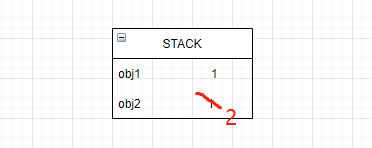
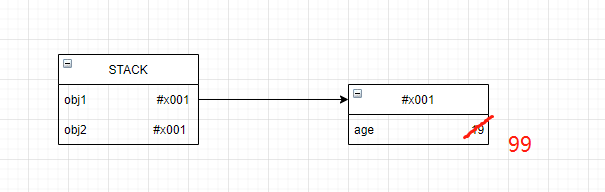

### 数据存储
**基本数据类型的值**(string,number,boolean,null,undefined,bigint,symbol)存储在**栈内存**中,存储空间大小固定
```js
let a = 1
let b = a;
b = 2
console.log(a) // 1
console.log(b) // 2
```


**引用类型的值（object)** 存储在**堆内存**中，因为数据类型嵌套，存储空间大小不固定，对应变量在栈内存中存储这引用类型的地址。
**注意这里是引用类型的值存储在堆内存中，而在栈中存储的是引用类型在堆中的地址。**
```js
const obj1 = {age:18}
const obj2 = obj1
obj2.age = 99
console.log(obj1.age) // 99
console.log(obj2.age) // 99
```
如下图所示，



### 关于数据的拷贝
拷贝是直接将存储在**栈中的值**复制一份
因此对于基本数据类型的值能够成功复制，而引用类型复制的是**地址**。（如上图所示）

### 深拷贝的实现
1. 借用JSON.stringfy和JSON.parse
> 优点：简单，适用于类似json结构的数据
> 缺点：忽略undefined属性； 忽略symbol属性，函数，循环引用问题
```js
function deepClone(obj) {
    return JSON.parse(JSON.stringify(obj))
}
```
2. 简单实现 
> 考虑到对象的层次嵌套，可以使用递归，首要解决的问题：循环引用引起的**爆栈**问题
> RangeError: Maximum call stack size exceeded
```js
// 判断是否为对象
function deepClone(obj,map = new WeakMap()) {
    if(obj&&typeof obj === 'object') {
        let cloneTarget = Array.isArray(obj)?[]:{};
        // 引入map解决循环引用的问题
        // 能够正确判断出循环引用
        if(map.get(obj)) {
            return map.get(obj)
        }
        map.set(obj,cloneTarget)

        for(const key in obj) {
            cloneTarget[key] = deepClone(obj[key],map)
        }
        return cloneTarget
    } else {
        return obj
    }
}
```
3. 引入lodash库
> 全，稳定
### map和weakMap
> weakMap的键是弱引用的
API: 
- clear()
- delete(k)
- get(k)
- has(k)
- set(k)


引入wiki中的解释：在计算机程序设计中，弱引用与强引用相对，是指不能确保其引用的对象不会被垃圾回收器回收的引用。一个对象若只被弱引用所引用，则被认为是不可访问（或弱可访问）的，并因此可能在任何时刻被回收。 （也就是说这玩意随时都可能被回收）


### 参考
- http://www.conardli.top/blog/article/JS%E8%BF%9B%E9%98%B6/%E5%A6%82%E4%BD%95%E5%86%99%E5%87%BA%E4%B8%80%E4%B8%AA%E6%83%8A%E8%89%B3%E9%9D%A2%E8%AF%95%E5%AE%98%E7%9A%84%E6%B7%B1%E6%8B%B7%E8%B4%9D.html#%E5%BE%AA%E7%8E%AF%E5%BC%95%E7%94%A8
- 