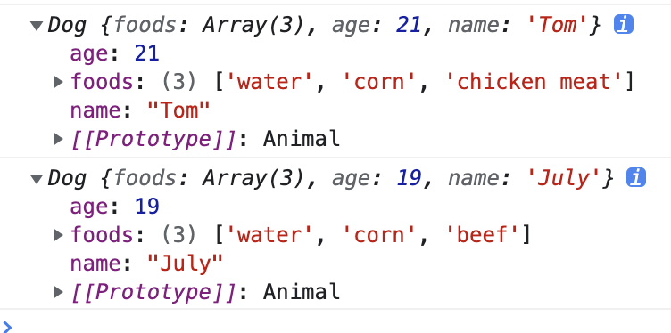

### JS中描述对象
> 可以使用```Object.defineProperty(obj,props,description)```进行定义
1. 数据属性
- configurable
- enumerable
- writable
- valuef
```js
let person = {}
Object.defineProperty(person,'name',{
    writable:false,
    value:'bob'
})
```
2. 访问器属性
- get
> 访问属性的时候，会默认调用这个get函数
- set
- configurable
- enumerable


### 面向对象编程中的继承
> 封装，继承，多态
创建对象方式
1. 工厂模式
> 未解决对象标识的问题
```js
// 工厂模式
function createPerson(name, age, job) {
    // 返回一个函数
    return {
        name,
        age,
        job,
        sayName() {
            console.log('Hi,I am ', this.name)
        }
    }
}

const Bob = createPerson('Bob', 21, 'coder')
Bob.sayName()
```

2. 自定义构造函数
> 解决对象的标识问题
> 缺点：函数也是实例===>Function的实例，构造函数上的函数并没有做到复用. (相同逻辑的函数没有必要重复定义)
```js
function Person(name,age) {
    this.name = name
    this.age = age
    this.sayName() {
        console.log(this.name)
    }
    /**
     * 别忘了函数也是对象，是Function的实例
     * this.sayName = new Function('console.log(this.name)')
    */
}
const bob = new Person('bob',21)
const alice = new Person('alice',22)
// bob和alice都认为是Person的实例
console.log(bob instanceof Person) // true
console.log(alice instanceof Person) // true
```
3. 原型模式
> 每个函数都会创建一个prototype对象，包含应该由特定引用类型的的实例共享的属性和方法。


### 继承
1. 原型继承
> 
> 缺点：
> 1. 引用值在所有实例间共享的问题; 
> 2. 子类在实例化时无法给父类构造函数传参 
```js
function SuperType(age) {
    this.age = age
    this.colors = ['red','green']
}
// 为什么要
SubType.prototype = new SuperType()
function SubType() {
}
const b = new SubTyep()
```
2. 盗用构造函数
> 核心：在子类的环境之执行父类的方法
> 解决了引用值的问题
> 子类无法 ”借用“(不用开辟新的空间存储) 父类的方法定义在原型上的方法 导致所有属性只能使用构造函数模式
> 也就是说，所有属性，不管是函数也好（通常我们希望相同逻辑的函数能有复用），都必须定义构造函数上才能够 "复用"。
```js
function SuperType(age) {
    this.age = age
    this.colors = ['red','green']
    this.sayAge = function() {console.log(age)}
}
// 为什么要
function SubType(age) {
    SuperType.call(this,age)
}
```

3. 组合继承
> 结合原型继承和盗用构造函数的两者的优点
>  解决了值引用的问题，子类实例化时可以向父类传参。
```js
function Animal(age) {
        this.foods = ['water', 'corn']
        this.age = age;
    }
    Animal.prototype.sayAge = function() {
        console.log(this.age)
    }
    Animal.prototype.addFood = function(f) {
        console.log(this.foods.push(f))
    }

    function Dog(age, name) {
        Animal.call(this, age)
        this.name = name
    }
    Dog.prototype = new Animal()
    Dog.prototype.sayName = function() {
        console.log(this.name)
    }
    const tom = new Dog(21, 'Tom')
    tom.addFood('chicken meat')
    const july = new Dog(19, 'July')
    july.addFood('beef')
    console.log(tom)
    console.log(july)
```


