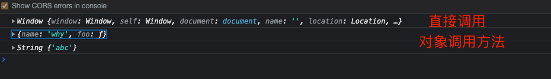
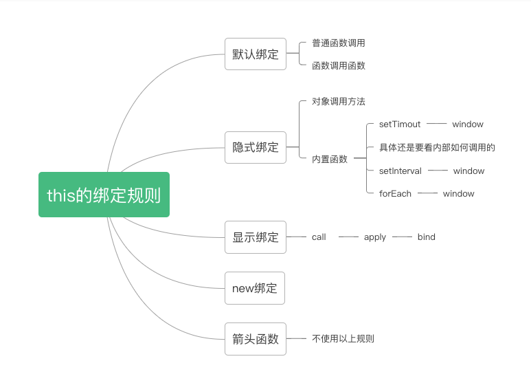

### 什么是this？

所有函数在调用的时候回创建一个执行上下文：
- 记录函数调用栈，函数的调用方式，传入的参数信息
- this也是执行上下文中的一个属性

### this绑定的特点

- **this的绑定是根据调用方式，和调用位置来决定的。**
- this是在运行时被绑定。

```js
function foo() {
    console.log(this);
}

// 直接调用
foo();

var obj = {
    name: "why",
    foo: foo
}

// 函数调用
obj.foo();


// call aplly
foo.call("abc");
```




### 通常我们在函数中是用this
### this的绑定方式



函数中的this无非就是在函数别调用的手绑定一个对象

1. 默认绑定

- 普通函数的调用

```js
function foo() {
  console.log(this);
}
foo();
// window
```


- 函数调用另外一个函数

```js
function foo() {
  console.log(this);
}
function invokeFoo() {
  foo();
}
invokeFoo();
// window
```

```js
function foo(func) {
  	func();
}
const obj = {
  name:"even",
  bar:function() {
    console.log(this)
  }
}
// 隐式丢失
foo(obj.bar);
// window
```


- 函数作为参数传递到另外一个函数（callback

```js
function foo() {
  console.log(this);
}
function callFoo(func) {
  // 在函数内部直接执行
  func();
}
callFoo(foo);
// window
```


2. 隐式绑定

通过某个对象来发起函数的调用`obj1.func()`， , 多个对象链式`obj2.obj1.func()` this指向最近的那个对象，即`obj1`

```js
function foo() {
  console.log(this);
}
const obj = {
  name:"even",
  foo:foo
}
obj.foo();
// {name:"even",foo:f}
```

隐式丢失

```js
// 这里相当于定位了foo函数，知识一个简单的赋值操作
const testfun = obj.foo
// 函数执行
testfun();
// window
```


3. 显示绑定

- call 参数列表
- apply 数组
- bind 参数列表

4. 一些内置函数

```js
setTimeout()
setInterval
// 默认情况下，直接调用函数
arr.forEach(); // window

事件的监听 // 指向监听的元素 
```

5. new 绑定

跟new的执行机制有关

6. 箭头函数

其内部没有this，在箭头函数内部访问this会默认使用当前最近的作用域链中的this

**不适用以上所有的规则**


* 特殊情况

```js
var nums = 100;
var num2 = 0;
// 表达式整体的值，等于赋值的右方
var result = (num1 = num2)
console.log(result);
```

```js
function foo() {
  console.log(this);
}
var obj1 = {
  name:"obj1",
  foo:foo
}
var obj2 = {
  name:"obj2",
}
// 相当于直接调用foo()
(obj2.foo = obj1.foo) ();
```


### this的绑定 
1. 显示指出this， call / apply/ bind
2. 全局上下文, this --> 全局
3. 直接调用函数 , this --> 全局
4. DOM事件绑定, this--> 元素
5. new执行构造函数： this--->当前实例
6. 箭头函数
> 箭头函数没有this, 因此也不能绑定。里面的this会指向当前最近的非箭头函数的this，找不到就是window(严格模式是undefined)

### 优先级
new > call,apply,bind  > 对象.方法 > 直接调用

### 函数的调用方式与显示绑定的切换
- func() 等价于 func.call(undefined)
- obj.func() 等价于 obj.func.call(obj)
- func.call(obj)
当call中第一个参数为undefined的时候，默认为window

### 相关面试题

```js
var name = "window";

var person = {
    name: "person",
    sayName: function() {
        console.log(this.name);
    }
}

function sayName() {
    var ss = person.sayName;
    // 独立函数调用
    ss();
    // 和对象关联
    person.sayName();
    (person.sayName)();
  	// 先确定整体语句的值，为一个函数，然后普通调用
    (b = person.sayName)();
}
sayName();
// window
// person
// person
// window
```

```js
var name = 'window';
var person1 = {
    name: "person1",
    foo1: function() {
        console.log(this.name)
    },
    foo2: () => {
        console.log(this.name);
    },
    foo3: function() {
        return function() {
            console.log(this.name)
        }
    },
    foo4: function() {
        return () => {
            console.log(this.name);
        }
    }

}
var person2 = { name: "person2" };
// 隐式绑定
person1.foo1(); // person1
// 显示绑定 > 隐式绑定
person1.foo1.call(person2) // person2


// 箭头函数 ，不使用所有规则
person1.foo2(); // window
person1.foo2.call(person2); // window

// foo3返回的是一个普通函数
person1.foo3()(); // window
person1.foo3.call(person2)(); // window
person1.foo3().call(person2); // person2


person1.foo4()(); // person1
person1.foo4.call(person2)(); // person2
person1.foo4().call(person2); // person1
```


- https://juejin.cn/post/6844904083707396109

### 手写call,apply,bind
> 主要目的，深入理解这几个函数的原理
1. call
```js
Function.prototype.mycall = function(context,...args) {
    context = context || window;
    // this指向调用的函数实例
    context.ctxFunc = this;
    const result = context.ctxFunc(...args)
    delete context.ctxFunc
    return result;
}

function test(name) {
    console.log(this,name)
}
const obj = {name:'JS'}
test.mycall(obj,'Bob')
// {name:'JS'} 'Bob'
```
2. apply
> 参数以数组的形式传入,可以借此改变参数传入的方式
```js
Function.prototype.myapply = function(context,args) {
    context = context || window;

    context.ctxFunc = this;
    
    const result = context.ctxFunc(args)
    
    delete context.ctxFunc

    return result;
}
```
3. bind
```js
Function.prototype.mybind = function(context,...args){
    context = context || window;
    context.ctxFunc = this;

    return function() {
        const result = context.ctxFunc(...args);
        delete context.ctxFunc;
        return result;
    }
}
```