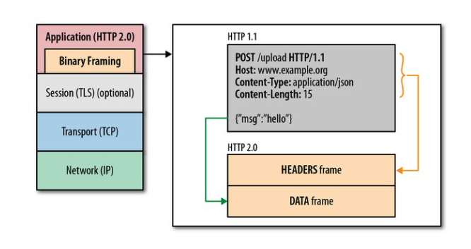
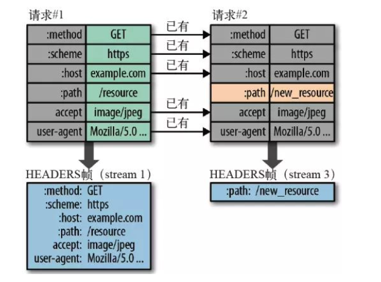

#### Network基本概念

- OSI(Open Systems Interconnction) 开放系统互连分层（top town）
  1. application 应用层：  (常见的应用协议：HTTP,FTP,EMIAL,SSH...)
  2. presentation 表示层
  3. session 会话层
  4. transport 传输层: TCP/UDP协议
  5. network 网络层:  IP协议 （定位主机）
  6. data link  数据链路层
  7. phisical 物理层: 电器信号传输, 网卡（mac地址.....)


### HTTP基于响应，一问一答

### HTTP （**H**yper**T**ext **T**ransfer **P**rotocol）
> HTTP建立在TCP上的应用层协议。发起HTTP请求需要先建立TCP连接。

- HTTP/1.0: client每次发起HTTP请求需要建立一个单独的TCP连接，处理完请求后，自动释放。因此叫做**短链接**

- HTTP/1.1：HTTP/1.1支持长连接（Persistent Connection）和请求的流水线（Pipelining）处理。在一个TCP连接上可以传送多个HTTP请求和响应 （但是，客户端可以同时发送多个，但是响应不是同时，而是在服务端**排着队一个接着一个**，诱发队列头阻塞，在HTTP/2.0中引入多路复用（响应不用排队了直接冲），解决此问题），减少了建立和关闭连接的消耗和延迟。 在HTTP1.1中默认开启Connection： keep-alive，一定程度上弥补了HTTP/1.0每次请求都要创建连接的缺点。

- HTTP/2.0: 支持**多路复用**，一个TCP可**同时传输多个http请求**，头部压缩. (同时这里理解与Htpp1.0的区别很关键，HTTP/1.1在响应服务端排队会导致队头阻塞，而HTTP/2.0不用排队，但是如果出现问题)


  具体实现：二进制分帧
  


  具体实现：头部压缩
  > 头部信息使用gzip或compress压缩后再发送，同时客户端和服务器同时维护一张头信息表，所有字段都会 存入这个表，生成一个索引号，以后就不发送同样字段了，只发送索引号，这样就提高速度了。
  

   具体实现： 多路复用
   > 不再限制同一个月域名下的连接


### HTTP/2遗留问题:队头阻塞
HTTP/2 也存在队头阻塞问题，比如丢包。

如果造成队头阻塞，问题可能比http1.1还严重，因为只有一个tcp连接，后续的传输都要等前面，http/1.1 多个tcp连接，阻塞一个，其他的还可以正常跑。


### HTTP常见方法
- GET 获取数据

- HEAD 响应只有头部

- POST 提交数据到服务器

- PUT 

- DELETE

- OPTIONS 预检测，查看服务端是否允许 "跨域" 

  > 跨域：协议，域名，端口，其中一个不同就是跨域（Cross Resourece Share）
  >
  > **非简单方法触发预**该请求，浏览器自动发送
  >
  > 所谓简单方法，是指：
  >
  > - 只使用 GET, HEAD 或者 POST 请求方法。如果使用 POST 向服务器端传送数据，则数据类型(Content-Type)只能是 application/x-www-form-urlencoded, multipart/form-data 或 text/plain中的一种。
  > - 不会使用自定义请求头（类似于 X-Modified 这种）。

  服务端对 OPTIONS 预请求给出允许回应

- TRACE

- PATCH 

### HTTP与TCP区分

- HTTP是应用层协议定义的是传输数据的**内容和规范**，TCP是传输层协议定义的**是数据传输和连接方式的规范。**

- HTTTP协议建立在TCP协议之上，HTTP在发起请求通过TCP协议建立与服务器的通道。

  >  好比：A和B打电话，电话信道在这里类似于TCP，规定你们需要使用电话来通话； 至于你们讲中文，法语啥的这就是应用传递的是内容。


### HTTP各个版本协议的对比

- HTTP/1.1的性能缺陷

  1. 队头阻塞导致高延迟

     > HTTP/1.1引入了管道机制，也就是多同一个TCP连接中客户端可以同时发送多个请求
     >
     > 但是，服务端必须按要求发送的顺序返回响应，当顺序请求多个文件的时候，其中一个请求被阻塞，在后面排队的所有请求也会一并被阻塞，这就是：**对头阻塞**。

     HTTP/1.1下的优化：

     - 使用多个域名，突破浏览器对同域名连接的限制数。将页面的资源分布在不同的服务器中，使用不同的域名。

     - 减少资源网络请求的数量。将资源合并：雪碧图，小图片转为base64编码后内嵌到HTML或者CSS中, webpack打包将j s文件打包为一个，只需请求一次（问题：内容变化，全部加在）， 按需加载等等.......

       #背景图用base64编码
       
       ```css
        
       .icon {
           background: url(data:image/png;base64,<data>) no-repeat;
       }
       ```

  2. 明文传输：不安全

  3. 无状态：头部巨大且重复

     > cookie, user-agent 等等头部字段重每次请求开销大

  4. 不支持服务器推送

     > 比如服务端数据更新了，客户端只能通过间断性的发送请求来查看数据是否更新，耗费大。
     >
     > 如果服务器可以推送，只要一次推送就可以将数据同步到客户端。

- HTTP/2新特性

  > 基于SPDY，专注于性能，最大的目标**用户和网站之间只有一个连接** 
  >
  > SPDY (是spedy的缩写)

  1. 二进制传输

     在应用层HTTP/2和传输层（TCP or. UDP)之间增加一个二进制分帧

     

2. 头部压缩

   > 两个主要措施：
   >
   > 1. 头部信息用gzip或compress压缩后再发送
   > 2. 客户端和服务器同时维护一张是信息表，所有字段都会存入这张表，生成一个索引号，后面只需发送索引。

3. 多路复用 & 多工

   > 解决了浏览器对同一域名连接的限制，
   >
   > 同时返回和响应可以多个同时发送和返回
   >
   > 优先级

4. 数据流

   > HTTP/2中数据包叫做数据流，每个数据流具有独一无二的Id。客户端发出的为奇数，服务端发出的的为偶数。
   >
   > 数据流发送到一半的时候，客户端和服务器都可以发送信号(RST_STREAM帧)，取消这个数据流。HTTP/ 1.1版取消数据流的唯一方法，就是关闭TCP连接。这就是说，HTTP/2 可以取消某一次请求，同时保 证TCP连接还打开着，可以被其他请求使用。

5. 支持服务端推送

### HTTP/2的遗留问题

#### HTTP2还存在队头阻塞吗？

>  HTTP/2 也存在队头阻塞问题，比如丢包。 如果造成队头阻塞，问题**可能比http1.1还严重**，因为只有一个tcp连接，后续的传输都要等前面。
>
> http/1.1 多个tcp连接，阻塞一个，其他的还可以正常跑。


### HTTP3

前面HTTP/2 HTTP/1等存在的问题
- 队头阻塞，虽然HTTP/2支持多路复用，但是TCP协议不支持
- 建立连接时间长（TCP的三次握手）


### HTTPS的简介
HTTPS 其实是 HTTP+SSL/TLS 的简称