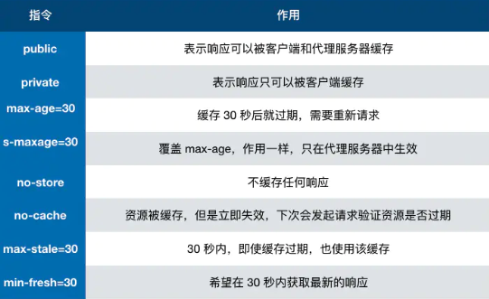

## 浏览器缓存
适用于不常发生发生的资源，提高页面的加载速度
### 强缓存
状态码：200
> 不需要发送请求到服务端，直接读取浏览器本地的缓存，在Chrome的network面板中显示的HTTP状态码为200，在Chrome中强缓存的位置分为Disk Cache和 Memory Cache，存放的位置由浏览器控制。是否使用强缓存由头部`Expires`, `Cache-Control`,`Pragma`控制。

1. Expires
本地机器的时间和Expires比较；如果超出了`Expires`的值，缓存失效。
本地机器的时间可以修改，可能会存在本地机器时间和服务器时间不一致问题。
优先级：最低
```sh
# 绝对值
Expires: Wed, 22 Oct 2018 08:41:00 GMT
```
2. Cache-control
```sh
# 相对值
# Cache-Control 是一个相对时间，即使 客户端时间发生改变，相对时间也不会随之改变，这样可以保持服务器和客户端的时间一致性。而且 Cache-Control 的可配置性比较强大。
Cache-control: max-age=30
# max-age取值如下
```

3. Pragma
优先级最高,与`Cache-Control:no-cache;`效果一样
```sh
# 不使用强缓存
Pragma: no-cache;
```
### 协商缓存 
状态码：304
> 协商缓存: **强缓存失效后**，浏览器携带缓存标识向服务器发起请求，由服务器根据缓存标识决 ，定是否使用缓存的过程。
>
> 协商：浏览器与服务器协商

1. Last-Modified和If-Modified-Since
值：`表示文件最后修改的时间`，第一次请求服务端将资源最后修改的时间放入Last-Modified中，第二次发起请求的时候，请求头带上上一次响应头的Last-Modified中的值，放入If-Modified-Since请求头中。

- Etag和If-None-Match
值： `根据文件的内容生成的hash值`
文件的修改评率在秒级一下，`Last-Modified/If-Modified-Since`会没法正确作出响应
文件修改了，但内容没有任何变化


### 浏览器的缓存过程

 发起请求前，先看浏览器缓存中是否存在对应资源（），如果有直接返回，不发送网络请求，如果没有，发送网路请求加载资源，得到资源后根据返回的缓存策略来对资源缓存

 