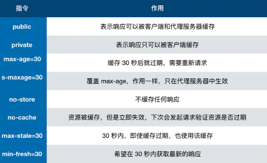

# HTTP的首部字段

### 缓存的首部字段

- Expires: 响应头，代表资源的过期时间
- Cache-Control：请求、响应头，缓存控制

- If-Modified:响应头，资源最近修改的时间，由浏览器告诉服务器
- Etag:响应头，资源标识，有服务器告诉浏览器
- If-None-Match：请求头，缓存资源标识，浏览器告诉服务器


### 强缓存

> 强缓存: 向浏览器缓存查找该请求结果，并根据该结果的缓存规则来决定是否使用该缓存结果 的过程。
>
> 强缓存控制是否需要发送网络请求。
1. Cache-Control
2. Expires

(优先级排序)

```sh
# 绝对值
Expires: Wed, 22 Oct 2018 08:41:00 GMT
```

```sh
# 相对值
# Cache-Control 是一个相对时间，即使 客户端时间发生改变，相对时间也不会随之改变，这样可以保持服务器和客户	端的时间一致性。而且 Cache-Control 的可配置性比较强大。
Cache-control: max-age=30
# max-age取值如下
```



### 协商缓存

> 协商缓存: **强缓存失效后**，浏览器携带缓存标识向服务器发起请求，由服务器根据缓存标识决 ，定是否使用缓存的过程。
>
> 协商：浏览器与服务器协商

- Last-Modified和If-Modified-Since
- Etag和If-None-Match


### 浏览器的缓存过程

 发起请求前，先看浏览器缓存中是否存在对应资源（），如果有直接返回，不发送网络请求，如果没有，发送网路请求加载资源，得到资源后根据返回的缓存策略来对资源缓存

 