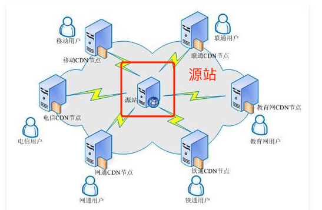

## 什么是CDN?
内容分发网络（Content Delivery Network，CDN）通过将站点内容发布至遍布全球的海量加速节点，**使其用户可就近获取所需内容，避免因网络拥堵、跨运营商、跨地域、跨境等因素带来的网络不稳定、访问延迟高等问题**，有效提升下载速度、降低响应时间，提供流畅的用户体验。 

### CDN缓存的缺点
CDN的分流作用不仅减少了用户的访问延时，也减少的源站的负载。但其缺点也很明显：当网站更新时，如果CDN节点上数据没有及时更新，即便用户再浏览器使用Ctrl +F5的方式使浏览器端的缓存失效，也会因为CDN边缘节点没有同步最新数据而导致用户访问异常。 **(源站和CDN节点同步数据的及时性)**

### CDN的缓存时间对CDN服务的影响
若CDN缓存时间较短，CDN边缘节点上的数据会经常失效，导致频繁回源，增加了源站的负载，同时也增大的访问延时；若CDN缓存时间太长，会带来数据更新时间慢的问题。开发者需要增对特定的业务，来做特定的数据缓存时间管理。