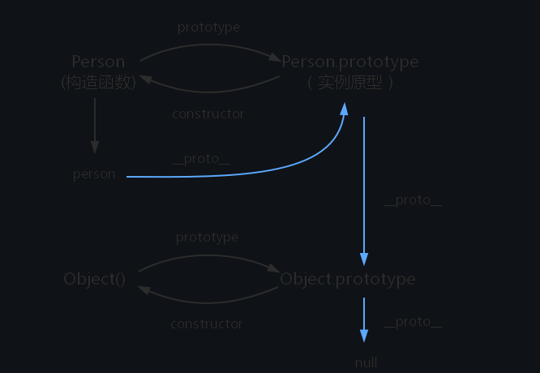
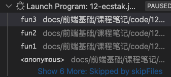
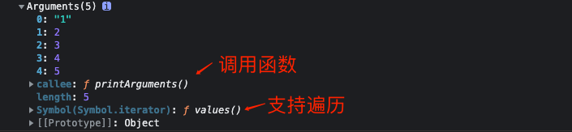

# 1. JavaScript深入之从原型到原型链
### 实例，原型和原型链
```js
function Person() {

}
var person = new Person();
console.log(person.__proto__ == Person.prototype)
```



# 2. JavaScript深入之词法作用域和动态作用域
JavaScript使用的是词法作用域，也是静态作用域，白话：根据定义的位置来查找.
作用域链是在函数定义的时候创建的。
```js
var scope = "global scope";
function checkscope() {
    var scope = "local scope";
    return f() {
        return scope;
    }
    return f();
}
const res = checkscope();
console.log(res); // local scope
```

```js
var scope = "global scope";
function checkscope() {
    var scope = "local scope";
    function f() {
        return scope;
    }
    return f;
}
const res = checkscope()();
console.log(res); // local scope
```


# 3. JavaScript深入之执行上下文栈
可执行代码
1. 全局代码
2. 函数代码
3. eval代码

### 3.  执行上下文
可执行代码执行前进行代码的执行的准备工作，创建执行上下文 (execution stack)
管理执行上下文的栈叫做执行上下文栈(Execution context stack)

```js
ECStack = [];
```
代码举例
```js
function fun3() {
    console.log('fun3')
}
function fun2() {
    fun3();
}
function fun1() {
    fun2();
}
fun1();
```
对应执行上下文栈
```js
ECStack = [
    fun3Context,
    fun2Context,
    fun1Context,
    globalContext,
]
// 执行过程中使用栈来控制函数执行
```



> 这里的anonymous代表的第一个进入执行上下文栈，也就是全局执行上下文


# 4. JavaScript深入之变量对象
- 变量对象 （Varibale object VO)
- 作用域链 (Scope Chian)
- this

全局上下文中的变量对象
> 全局上下文中的变量对象就是全局对象呐！

函数上下文中的变量对象
> 在函数上下文中，我们用活动对象(activation object, AO)来表示变量对象。
函数进入执行上下文会分为链各个阶段：分析和执行
1. 进入执行上下文
函数所有的形参:
- 由名称和对应值组成的一个变量对象的属性所创建
- 没有实参，属性值为undefined

函数的声明
- 由名称和对应值组成的一个变量对象的属性被创建
- 后面覆盖前面的

变量的声明
- 名称和undefined
- 如果变量名称跟已经声明的形式参数或函数相同，则变量声明不会干扰已经存在的这类属性

```js
function foo(a) {
  var b = 2;
  function c() {}
  var d = function() {};

  b = 3;

}
foo(1);
```
```js
AO = {
    arguments: {
        0: 1,
        length: 1
    },
    a: 1,
    b: undefined,
    c: reference to function c(){},
    d: undefined
}

```
2. 代码执行
在代码执行阶段，会顺序执行代码，根据代码，修改变量对象的值
```js
AO = {
    arguments: {
        0: 1,
        length: 1
    },
    a: 1,
    b: 3,
    c: reference to function c(){},
    d: reference to FunctionExpression "d"
}
```
例题:
```js
console.log(foo);

function foo(){
    console.log("foo");
}

var foo = 1;
```
会打印函数，而不是 undefined 。

这是因为在进入执行上下文时，**首先会处理函数声明，其次会处理变量声明，如果变量名称跟已经声明的形式参数或函数相同，则变量声明不会干扰已经存在的这类属性。**


### 总结
1. 全局上下文的变量对象初始化是全局对象

2. 函数上下文的变量对象初始化只包括 Arguments 对象

3. 在进入执行上下文时会给变量对象添加形参、函数声明、变量声明等初始的属性值

4. 在代码执行阶段，会再次修改变量对象的属性值

# 5. JavaScript深入之作用域链
**作用域链的查找机制**： 当查找变量的时候，会先从当前上下文的变量对象中查找，如果没有找到，就会从父级(词法层面上的父级)执行上下文的变量对象中查找，一直找到全局上下文的变量对象，也就是全局对象。这样由多个执行上下文的变量对象构成的链表就叫做作用域链。

# 6. JavaScript深入之从ECMAScript规范解读this 
> 没看懂 ; 四种情况？

# 7. JavaScript深入之执行上下文
> 不理解； 大致讲了上面两个的执行过程

# 8. JavaScript深入之闭包
经典例题： 从变量对象的角度分析
```js
for(var i = 0; i < 5; i++ ) {
    setTimeout(() => {
        console.log(i);
    })
}
```

# 9. JavaScript深入之参数按值传递

# 10. JavaScript深入之call和apply的模拟实现

### call
> call() 方法在使用一个指定的 this 值和若干个指定的参数值的前提下调用某个函数或方法。
```js
Function.prototyep.call2 = function(context) {
    // 当context为null或者undefined的时候
    context = context || window;
    context.fn = this;
    var args = [];
    for(var i = 1, len = arguments.length ; i < len;i++ ) {
        args.push(`arguments[${i}]`)
    }
    const result = eval(`context.fn(${args})`);
    delete context.fn
    return result;
}
```
### apply的模拟实现
```js
Function.prototype.apply2 = function(context,arr) {
    constext = Object(context) || window;
    context.fn = this;
    let result;
    if(!arr) {
        result = context.fn();
    } else {
        for(let i = 0,len = arr.length; i < len; i++) {
            args.push(`arguments[${i}]`)
        }
        result = eval(`context.fn(${args})`);
    }
    delete context.fn;
    return result;
}
```


# 11. JavaScript深入之bind的模拟实现
未考虑new调用的的情况
```js
Function.prototype.bind = function(context) {
    context = context || window;
    const self = this;
    const args = [].slice.call(arguments,1);
    return function() {
        cosnt bindArgs = [].slice.call(arguments)
        return self.apply(context,args.concat(bindArgs));
    }
}
```
处理new调用
```js
Function.prototype.bind2 = function(context) {
    if(typeof this !== "function") {
        throw new Error("What is trying to be boud is not a function");
    }
    const self = this;
    var args  = [].slice.call(arguments,1);
    const fNOP = function() {}
    const fBound = function() {
        const bindArgs = [].slice.call(arguments);
        return self.apply(this instanceof fNOP ? this: context,args.concat(bindArgs));
    }
    // 处理使用new操作符
    fNOP.prototype = this.prototype;
    fBound.prototype = new fNOP();
    return fBound;
}
```

# 12. JavaScript深入之new的模拟实现
```js
function objectFactory() {
    var obj = new Object();
    // 很巧妙，直接将第一项弹出
    Constructor = [].shift.call(arguments);
    obj.__proto__ = Construcrot.prototype
    var res = Constructor.apply(ojb,arguments);
    return typeof res === 'object'?res:obj;
}
```

# 13. JavaScript深入之类数组对象与arguments
> 拥有length属性和诺干个索引的对象
Arguments 对象只定义在函数体中，包括了函数的参数和其他属性。在函数体中，arguments 指代该函数的 Arguments 对象。
```js
function printArguments() {
    console.log(arguments);
}
printArguments('1',2,3,4,5)
```



ES6中的`...`代替类数组

# 14. JavaScript深入之创建对象的多种方式以及优缺点
> 相同逻辑的复用，同时保证对象的封装性
1. 工厂模式
缺点：无法识别对象
```js
function createPerson(name) {
    return {name}
}
``` 
2. 构造函数
优点：可以标识对象
```js
function Person(name) {
    this.name = function() {
        console.log(this.name)
    }
    // 每次创建对象时，该方法都需要创建
    // 一般相同逻辑不应该重复创建
    this.getName = function() {
        return this.name;
    }
}
```
3. 原型模式
> 优点：实现了相同逻辑的复用，解决了对象的标识问题
> 封装性有待提到
```js
function Person(name) {
    this.name = name;
}
Person.prototype.getName = function() {
    console.log(this.name);
}
```
4. 组合模式
```js
function Person(name) {

}
Person.prototype = {
    // 对象标识
    constructor: Person,
    getName: function () {
        console.log(this.name);
    }
};

var person1 = new Person();
```
5. 寄生构造函数模式
https://github.com/mqyqingfeng/Blog/issues/16
```js
funcion Person(name) {
    const o = new Object();
    o.name = nam;e
    o.getName = function() {
        conosle.log(this.name)
    }
    return o;
}
```
# 15. JavaScript深入之继承的多种方式和优缺点 
1. 原型链继承
```js
function Parent() {
    this.name = "Kevin";
}
Parent.prototype.getName = function() {
    console.log(this.name)
}
function Child() {
}

Child.prototype = new Parent();
var child1 = new Child();
console.log(child1.getName());
```

```js
function creatObj(o) {
    const clone = Object.create(o);
}
function Parent(name) {
    this.name = name;

}
```
# 参考

- https://github.com/mqyqingfeng/Blog/issues/10
