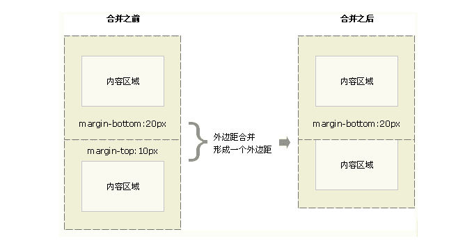

# 盒模型和BFC,IFC

### 盒模型示例图


### 盒模型的分类

css的属性display来设置
- content-box，默认值，border 和 padding 不计算入 width 之内
- border-box，border 和 padding 计算入 width 之内
- padding-box，padding 计算入 width 内

**计算整体宽高的方式不一样，使用`border-box`省事**。 当我们设置宽高的时，直接是整个大盒子的宽高。里面的内容可以自己随便调整。然而，如果非`border-box`的话，我们可能要通过padding/content反复调整。


### JS获取盒模型的宽高

- `dom.style.width/height`
- `dom.currentstyle.width/height`
- `window.getComputedStyle(dom).width/height`
- `dom.getBoundClientRect().width/height`


### 普通文档流垂直外边距(margin)折叠
合并后连个盒模型的外边距等于两个的较大者


### BFC 块级格式化上下文
BFC是web页面的可视CSS渲染的一部分，是块盒子的布局过程发生区域，也是浮动元素与其他元素交互的区域。

###  什么时候触发BFC? 以下是常见的触发方式
> https://developer.mozilla.org/zh-CN/docs/Web/Guide/CSS/Block_formatting_context
- 根元素 html
- float元素, 不是默认值none
- positioin:absolute/fixed
- display:inline-block / table-cell/flex/inline-flex/table-caption
- overflow:不为visiable
(详见MDN官网)
### BFC布局特点
块格式化上下文包含创建它的元素内部的所有内容
存在上下关系的都会计算在内。
### BFC应用
- 清除浮动
给包含浮动元素的容器的添加`清除浮动`,即容器为一个BFC
```css
#container::after{
  content:"";
  display:block;
  clear:both;
}
```
- 解决外边距`margin`折叠

### 什么是IFC?
行内级格式化上下文
### IFC常见应用
- 水平居中：当一个块要在环境中水平居中时，设置其为 inline-block 则会在外层产生 IFC，通过设置父容器 text-align:center 则可以使其水平居中
- 垂直居中：创建一个 IFC，用其中一个元素撑开父元素的高度，然后设置其 vertical-align:middle，其他行内元素则可以在此父元素下垂直居中
