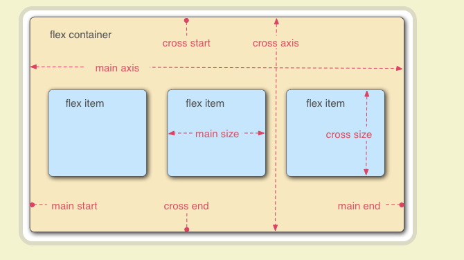
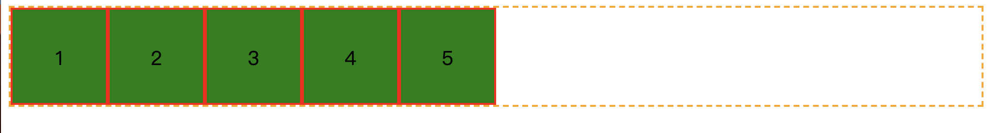
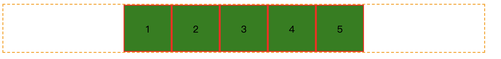
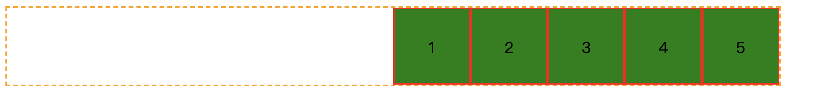
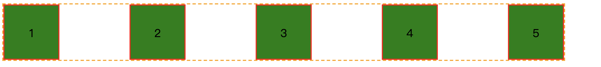
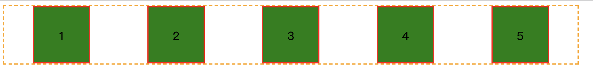
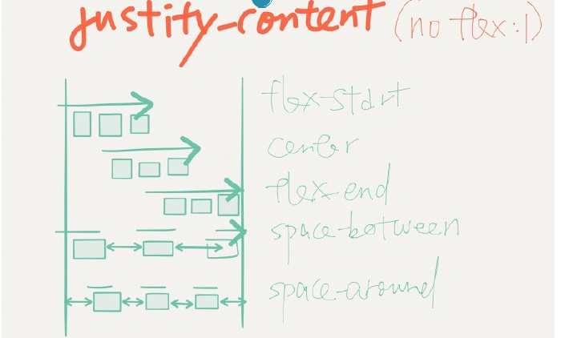
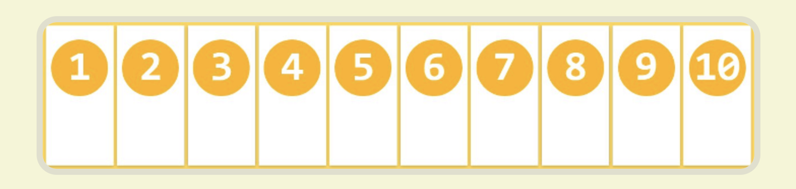
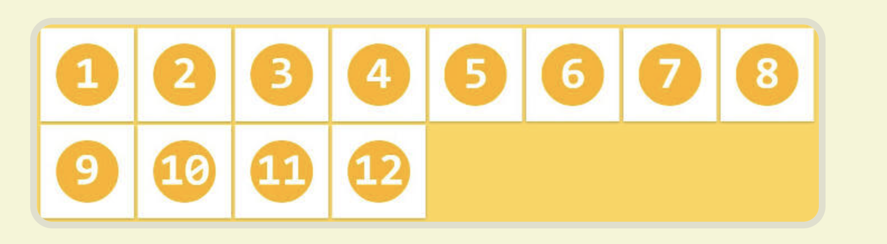
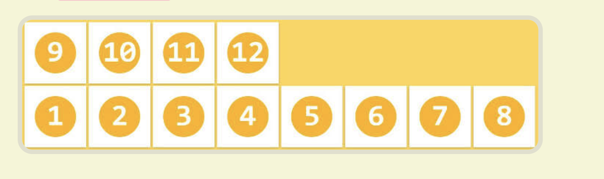

### flex
flext用来生成flex容器，是一种很好的布局方案，对移动端适配性很好。
采用flex布局的元素称为flex container，子元素为flex item.

布局特点

- 主轴 main axis
- 交叉轴 cross axis



### flex容器的属性 (6个)
- ### flex-direction
    
    决定子元素在flex容器中主轴的排列方向。主轴默认是水平从左到右的也即是row的方向。
    
    - row (默认值)
    - row-reverse
    - column
    - column-reverse
    
- ### **justify-content**
    
    定义了项目在主轴上的**对齐**方式
    
    - flex-start （默认）
    
    
    
    - center
    
    
    
    - flex-end
    
    
    
    - space-between
    
    
    
    - space-around
    
    
    
    假设主轴flex-direction为row(默认值)，水平从左到右的，设置justify-content的值的效果如下。
    
    
    
    
    
- ### **flex-wrap**
  
    如果轴线排列不下，换行.
    
    - nowrap (默认) 不换行
    
    
    
    - wrap 换行，第一行在上方
    
    
    
    - wrap-reverse 不换行，第一行在下方
    
    
    
- ### align-items
  
    定义flex item(就是位于flex  container下元素)在**交叉轴**(默认垂直防线，从上到下)上如何对齐
    
    - flex-start
    - center
    - flex-end
    - baseline
    - stretch
    
- ### align-content

    定义的多跟轴线的对齐方式

    - flex-start
    - flex-end
    - center
    - space-between
    - space-around
    - stretch

- ### **flex-flow**

    flex-direction和flex-wrap的简写 默认为 row nowrap;

```css
.container {
  flex-flow: row nowrap;
}
```


### flex项目的属性

剩余空间

- ### order

  定义项目的排列顺序。数值越小，排列越靠前，默认为0

- ### flex-grow

  定义项目的放大比例，默认为0, 如果

- ### flex-shrink

  属性定义了项目的缩小比例，默认为1，即如果空间不足，该项目将缩小。

- ### flex-basis

  浏览器根据这个熟悉，计算主轴是否有多余的空间。

- ### flex

- ### align-self


### 参考
- 阮一峰flex布局教程: https://www.ruanyifeng.com/blog/2015/07/flex-grammar.html