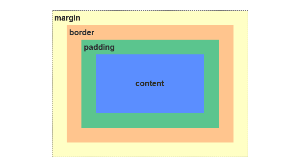
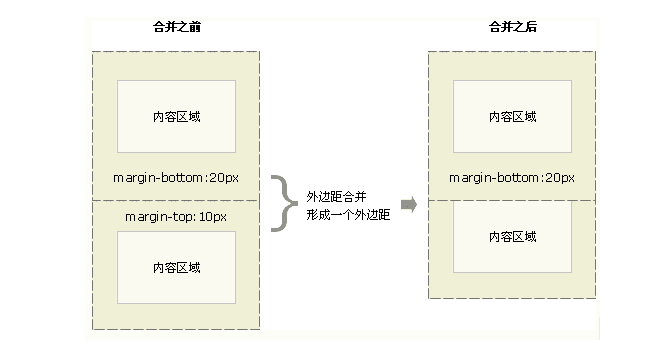

### 盒模型示例图




### 盒模型的分类

css的属性display来设置

- border-box
- content-box (默认)

**两者计算宽高的方式不一样，前者将border计算在内，后者不计算**使用`contetn-box`省事


### JS获取盒模型的宽高

- `dom.style.width/height`
- `dom.currentstyle.width/height`
- `window.getComputedStyle(dom).width/height`
- `dom.getBoundClientRect().width/height`


### 普通文档流垂直外边距(margin)折叠
合并后连个盒模型的外边距等于两个的较大者


### BFC 块级格式化上下文
```js
const url =
  'https://v.weishi.qq.com/v.weishi.qq.com/shg_0_1047_rsueafabs5qbbmcagbagbedvrxzwb6a264n6bibaqaafaiga.f0.mp4?dis_k=bb034e72483b875b70fad5feb12c63f0&dis_t=1563845358&guid=0508AFC000E081E13F01036CF26192E5&fromtag=0&personid=1535252226705971';

```