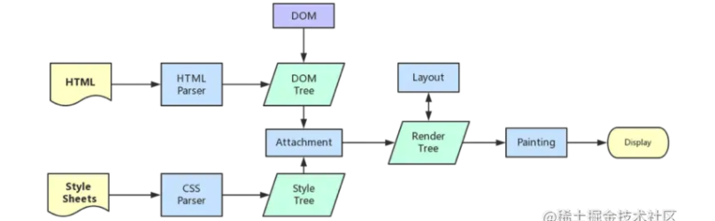

# 重排和重绘

### 重排

DOM元素的几何元素信息（元素的位置和尺寸大小），浏览器需要重新计算元素的集合数据，将其安放在界面的正确位置，这个过程叫做重排。也叫回流，简单的说就是重新生成布局，重新排列元素。

**出发重排的情况**

- 页面初始化渲染
- 添加，删除， 
- clientWith , offsetWidth scrollWidth
- getBoundingClient() / getComputedStyle/currentStyle 保证即时性。

由于浏览器渲染界面是基于流式布局模型的，所以出发重排会对周围DOM重新排列。

### 重绘

当一个元素的外观发生改变，但没有改变布局，重新把元素的外观绘制过程，叫做重绘。

#### 网页的解析流程

1. 解析HTML生成DOM Tree
2. 解析CSS生成CSSOM Tree
3. DOM Tree 和 CSSOM Tree 生成 Render Tree (Attachment)
4. 生成布局 flow, 浏览器画出渲染树种所有的点；
5. 将布局回执在屏幕上

#### 参考资料

- https://juejin.cn/post/6844904083212468238