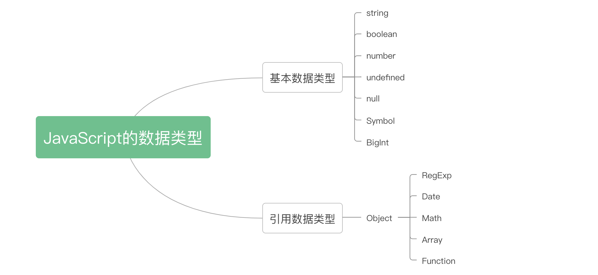
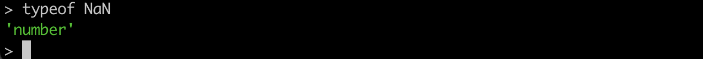
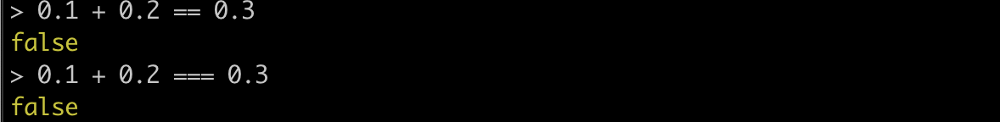
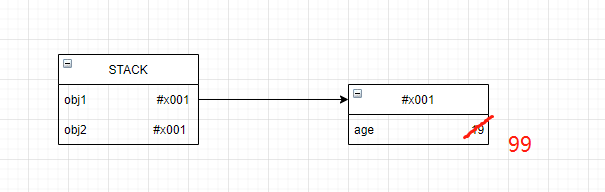
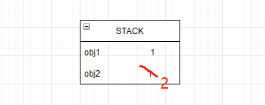
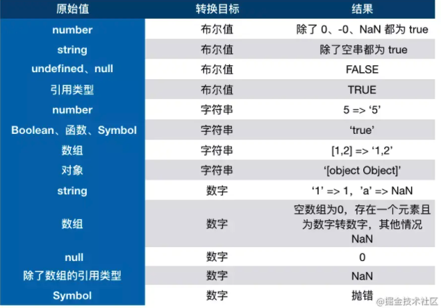

### JavaScript的基本数据类型及其相关问题

### Javascript的数据类型

JS中的数据类型分为`基本数据类型`和`引用数据类型`



1. 基本数据类型
> 存储的都是值
- string
- number



```js
  // 特殊的情况
  typeof NaN // number
  NaN === NaN // false
  // JS中的数字存储为IEEE 754标准，全部用浮点数存储，存在精度问题。
0.1 + 0.2 === 0.3 // false
```


- boolean
- null

```js
typeof null // 'object'
```
- undefined
- bigint
- symbol
2. 引用数据类型
- Object

### 引用类型和基本数据类型区别
传递值的时候（函数传参，赋值等），引用类型传递的值是"地址"，这个地址指向真正的值,而基本数据类型传递的是真正的值。如下示意图：
1. 引用数据类型（普通对象）
```js
let obj1 = {
  age:19
}
let obj2 = obj1
obj2.age = 99
```


2. 基本数据类型（数字：number）
```js
let obj1 = 1
let obj2 = obj1
obj2 = 2
```


## 数据类型的判断及其相关原理
### 问题一：如何判断数据类型?

1. typeof 方法，适用于**基本数据类型的判断**和函数的判断，但是typeof null的结果为object
```js
typeof function() {} // 'function'
```


> null不是对象，传统bug

   ```js
   typeof 1 // 'number'
   typeof false // 'boolean'
   typeof 'hello' // 'string'
   // 注意typeof对于未申明的变量也会出现undefined
   typeof undefined // 'undefined'
   typeof Symbol() // 'symbol'
   ```

2. instanceof ，适用于对象，用于判断```Son instanceof Father```，son是否为Father的实例,基于原型链的原理。

   MDN的解释：验证Father原型是否在Son的原型链上。

   > 缺点就是，在原型链上的都会认为是实例。 因此不用来辨别具体是哪个对象的实例。

### 问：instanceof是否可以判断基本类型?
可以的,MDN解释： **`Symbol.hasInstance`**用于判断某对象是否为某构造器的实例。因此你可以用它自定义 [`instanceof`] 操作符在某个类上的行为。

```js
   // Symbol.hasInstance可以让我们自定义,instanceof的行为
   class PrimitiveString {
     static [Symbol.hasInstance](x) {
       return typeof x === 'string'
     }
   }
   console.log('hello world' instanceof PrimitiveString) // true
```


   ### 简单实现instanceof原理：链表的遍历

   ```js
   // son为实例
   // father为一个构造函数
   // son沿着自己的原型链向下找，直到null(原型链的顶部)
   // 思路：其实这就是一个链表遍历的过程.
   function myinstanceof(son,father) {
     // 基本数据类型直接返回false
     if(typeof son !== 'object' || son == null) return false;
     const fatherPrototype = father.prototype
     let sonProto = son.__proto__
     while(sonProto !== null) {
       // 原型链的尽头是null
       	if(sonProto == fatherPrototype) {
           return true;
         }
       // 链表的遍历
       sonProto = sonProto.__proto__
     }
     return false;
   }
   
   // 测试代码
   const testFunc = ()=>{}
   const result = myinstanceof(testFunc,Function)
   console.log(result)
   ```

   

3. Object.prototype.toString.call
```js
   // --------------------------------------------------
   // 因此可以基于以上方法，封装一个函数来判断数据数据类型
   // https://javascript.ruanyifeng.com/stdlib/object.html#toc9
   // 看下阮一峰老师的优雅实现
   function type(val) {
    const result = Object.prototype.toString.call(val);
    // 这个正则，扣出数据类型名字
    return result.match(/\[object (.*?)\]/)[1].toLowerCase();
    }
    [
    'String',
    'Boolean',
    'Number',
    'Undefined',
    'Null',
    'Symbol',
    'Boolean',
    'Function',
    'RegExp'
    ].forEach(item => {
      // 构造出 isNumber...方法，放在type中， type看成Function的实例
    type['is' + item] = (val) => {
        return type(val) === item.toLowerCase();
    }});

// 以上代码生成以下函数用来判断数据类型
1. isString()
2. isBoolean()
3. isNumber()
4. isUndefined()
5. isNull()
6. isSymbol()
7. isFunction()
8. isRegExp()
```

#### 一行代码判断数据类型
```js
const getType = val => Object.prototype.toString.call(val).slice(8,-1).toLowerCase()
```


## 类型转换

> 涉及面试题：该知识点常在笔试题中见到，熟悉了转换规则就不惧怕此类题目了。

### 转Boolean

在条件判断时，除了 `undefined`， `null`， `false`， `NaN`， `''`， `0`， `-0`，其他所有值都转为 `true`，包括所有对象。

### 对象转原始类型

对象在转换类型的时候，会调用内置的 `[[ToPrimitive]]` 函数，对于该函数来说，算法逻辑一般来说如下：

*   如果已经是原始类型了，那就不需要转换了
*   调用 `x.valueOf()`，如果转换为基础类型，就返回转换的值
*   调用 `x.toString()`，如果转换为基础类型，就返回转换的值
*   如果都没有返回原始类型，就会报错

当然你也可以重写 `Symbol.toPrimitive` ，该方法在转原始类型时调用优先级最高。

```
let a = {
  valueOf() {
    return 0
  },
  toString() {
    return '1'
  },
  [Symbol.toPrimitive]() {
    return 2
  }
}
1 + a // => 3

```

### 四则运算符

加法运算符不同于其他几个运算符，它有以下几个特点：

*   运算中其中一方为字符串，那么就会把另一方也转换为字符串
*   如果一方不是字符串或者数字，那么会将它转换为数字或者字符串

```
1 + '1' // '11'
true + true // 2
4 + [1,2,3] // "41,2,3"

```

如果你对于答案有疑问的话，请看解析：

*   对于第一行代码来说，触发特点一，所以将数字 `1` 转换为字符串，得到结果 `'11'`
*   对于第二行代码来说，触发特点二，所以将 `true` 转为数字 `1`
*   对于第三行代码来说，触发特点二，所以将数组通过 `toString` 转为字符串 `1,2,3`，得到结果 `41,2,3`

另外对于加法还需要注意这个表达式 `'a' + + 'b'`

```
'a' + + 'b' // -> "aNaN"

```

因为 `+ 'b'` 等于 `NaN`，所以结果为 `"aNaN"`，你可能也会在一些代码中看到过 `+ '1'` 的形式来快速获取 `number` 类型。

那么对于除了加法的运算符来说，只要其中一方是数字，那么另一方就会被转为数字

```
4 * '3' // 12
4 * [] // 0
4 * [1, 2] // NaN

```

### 比较运算符

1.  如果是对象，就通过 `toPrimitive` 转换对象
2.  如果是字符串，就通过 `unicode` 字符索引来比较

```
let a = {
  valueOf() {
    return 0
  },
  toString() {
    return '1'
  }
}
a > -1 // true

```

在以上代码中，因为 `a` 是对象，所以会通过 `valueOf` 转换为原始类型再比较值。

## 

### 类型转换只能有三种

- 转为数字
- 转为boolean
- string



### 问题二：falsy和truthy是啥意思？
> 概念：中文翻译过来对应为:虚值和真值，也就对应boolean类型的true和false
### falsy对应
- false 
- null
- undefined
- '' 和"" (空字符串)
- NaN
- 0
- 0n （bigint）
- document.all(MDN上出现的)
其余的都是truthy
### 问题三:两等和三等的区别

相同点：双方都是对象时，只有指向同一对象才会相等 （地址相同才是相等）

不同：

1. **=== 要求双方类型相同并且值相等**

2. == 要求在比较双方类型不同的时候会进行类型转换，先转换为相同类型，再做比较。
1. 两个都为对象，引用同一地址的时候为真.
(基本类型vs基本类型， 基本类型vs引用类型)
2. 先看是否为null和undefiend, null == undefined // true
3. 操作数类型不同的时候：
  - 3.1. string和number , 将string --> number
  - 3.2. 其中一个boolean, 将boolean ---> number , 实际：true = 1 false = 0
  - 3.3. 如果是一个是对象，另一个是number和string, 调用valueOf() 和toString方法将对象转为原始值

```js
NaN === NaN // false
NaN == NaN // false
-0 == +0
-0 === +0
```
### Object.is的实现
>   与===相比，打了几个补丁
> 1. `Object.is(NaN,NaN) // true`
> 2. `Object.is(+0,-0) // true`

```js
if (!Object.is) {
  Object.is = function(x, y) {
    // SameValue algorithm
    if (x === y) { // Steps 1-5, 7-10
      // Steps 6.b-6.e: +0 != -0
      // 1/0 +Infinity  -Infinity
      return x !== 0 || 1 / x === 1 / y;
    } else {
      // Step 6.a: NaN == NaN
      return x !== x && y !== y;
    }
  };
}
```

### 问题四：数据类型是如何自动转换的?
- 转为boolean
  除falsy值外，其余为真
  
  > 0 空字符串 undefiend null NaN 0 0n document.all
  
- 对象转为string的流程
  1. [Symbol.toPromitive]
  2. valueOf
  3. toString
  依次调用以上定义在对象中的方法，如果返回了基本类型的值，就停止，则对应的基本类型之为返回的值。否则，报错。

  MDN解释：`**Symbol.toPrimitive**` 是一个内置的 Symbol 值，它是作为对象的函数值属性存在的，当一个对象转换为对应的原始值时，会调用此函数。

  ```js
  let a = {
    valueOf() {
      return 0
    },
    toString() {
      return '1'
    },
    [Symbol.toPrimitive]() {
      return 2
    }
  }
  1 + a // => 3
  ```
  问：a==1&&a==2
```js
const a = {
  value:0,
  valueOf() {
    this.value ++;
    return this.value
  }
};
if(a==1&&a==2) {
  console.log('a==1&&a==2')
}
解释：
a为对象，在与2相比时,
两次调用调用valueOf()，在这个函数中修改value的值,返回基本数据类型
```

