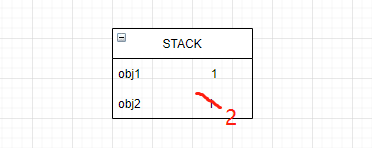

# 数据拷贝
### 数据存储
复习：基本数据类型的值(string,number,boolean,null,undefined,bigint,symbol)存储在`栈内存`中,存储空间大小固定
```js
let a = 1
let b = a;
b = 2
console.log(a) // 1
console.log(b) // 2
```


**引用类型的值（object)** 存储在**堆内存**中，因为数据类型嵌套，存储空间大小不固定，对应变量在栈内存中存储这引用类型的地址。
**注意这里是引用类型的值存储在堆内存中，而在栈中存储的是引用类型在堆中的地址。**
```js
const obj1 = {age:18}
const obj2 = obj1
obj2.age = 99
console.log(obj1.age) // 99
console.log(obj2.age) // 99
```
如下图所示，


### 关于数据的拷贝
拷贝是直接将存储在**栈中的值**复制一份
因此对于基本数据类型的值能够成功复制，而引用类型复制的是**地址**。（如上图所示）

因此：相对于深拷贝和浅拷贝，关键在于该数据类型是：引用数据类型。对于引用数据类型，它在栈中的变量存放的是一个地址，而真实的数据放在堆内存中，对堆内存中的数据复制一份才是深拷贝，而仅仅对堆内存中的数据进行赋值就是浅拷贝。
### 浅拷贝

1. Object.assign 
2. array.slice 拷贝数组
3. array.concat 拷贝数组
3. 扩展运算符
4. 自己实现 
```js
function clone(target) {
    if(typeof target === 'object' && target != null) {
        const cloneTarget = Array.isArray(target) ? [] : {};
        // 浅拷贝
        for(let prop in target) {
            cloneTarget[prop] = target[prop];
        }
    } else {
        return target;
    }
}
```
### 深拷贝的实现
1. 借用JSON.stringfy和JSON.parse
> 优点：简单，能够适用大多数场景
> 缺点：忽略undefined属性； 忽略symbol属性，函数，循环引用问题
```js
function deepClone(obj) {
    return JSON.parse(JSON.stringify(obj))
}
```

2. 简单实现 
> 考虑到对象的层次嵌套，可以使用递归，首要解决的问题：循环引用引起的**爆栈**问题
> RangeError: Maximum call stack size exceeded
```js
/**
 * 判断是否为引用类型
 * 核心：typeof 特殊处理null,function
 */
function isReferenceValue(val) {
    const type = typeof val;
    return val !== null && (type == 'function' || type == 'object')
}

function deepClone(val, map = new WeakMap()) {
    if (isReferenceValue(val)) {
        const clonedVal = Array.isArray(val) ? [] : {};
        // 解决循环引用的问题
        if (map.has(val)) {
            return map.get(val)
        }
        map.set(val, clonedVal)

        for (const key in val) {
            clonedVal[key] = deepClone(val[key], map)
        }
        return clonedVal;
    } else {
        // 非引用类型直接返回
        return val;
    }
}
```
缺点：
1. 这个深拷贝函数并不能复制`不可枚举`的属性以及 Symbol 类型；
2. 这种方法只是针对普通的引用类型的值做递归复制，而对于 Date、RegExp、Error、Function 这样的引用类型并不能正确地拷贝；

3. 深拷贝加强版？？？
```js
const isComplexDataType = val => {
    if(val == null) return false;
    const type = typeof val;
    if(type == 'object' || type == 'function') return true;
}
const deepClone = (target,map = new WeakMap()) => {
    const targetConstructor = target.constructor;
    let cloneTarget = null;
    switch (targetConstructor) {
        case Date:
            cloneTarget = new Date(target)
            break;
        case RegExp:
            cloneTarget = new RegExp(target)
            break;
        case Error:
            cloneTarget = new Error(target)
            break;
        case Function:
            cloneTarget = target;
            break;
    }
    if(cloneTarget != null) return cloneTarget;

    // 开始可迭代数据类型的赋值,先查找map中是否存有
    if(map.has(target)) return map.get(target)
    map.set(target,cloneTarget);
    for(let key in target) {
        const cur = target[key];
        if(isComplexDataType(cur)) {
            
        } else {
            return cur;
        }
    }
    return cloneTarget;
}

```
4. 引入lodash库
> 全，稳定
```js
const obj = {
    name: 'Bob',
    city: ['NY', "BY"],
}
obj.self = obj;

const _ = require('lodash')
console.log(_.cloneDeep(obj))
```
### map和weakMap
> weakMap的键是弱引用的，键必须为对象，
> 值可以为任意值
API: 
- clear()
- delete(k)
- get(k)
- has(k)
- set(k)

引入wiki中的解释：在计算机程序设计中，弱引用与强引用相对，是指不能确保其引用的对象不会被垃圾回收器回收的引用。一个对象若只被弱引用所引用，则被认为是不可访问（或弱可访问）的，并因此可能在任何时刻被回收。 （也就是说这玩意随时都可能被回收）


### 参考
- http://www.conardli.top/blog

