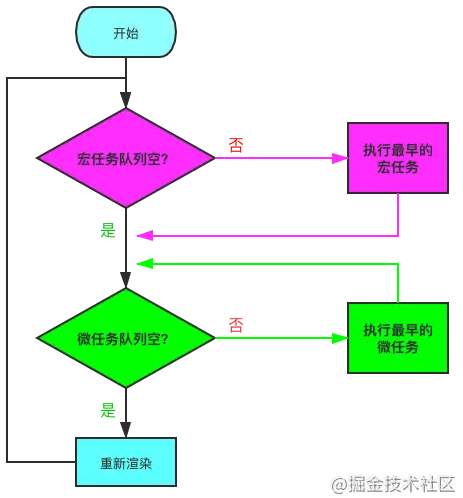

**什么是宏任务与微任务？**

为了提高CPU的利用效率：Js 有两种任务的执行模式：**同步模式（Synchronous）和异步模式（Asynchronous）**。

在异步模式下，创建**异步任务主要分为宏任务与微任务两种**。

- ES6 规范中，宏任务（Macrotask） 称为 Task， 微任务（Microtask） 称为 Jobs。宏任务是由宿主（浏览器、Node）发起的
- 微任务由 JS 自身发起。

**宏任务与微任务的几种创建方式** 👇

| **宏任务（****Macrotask****）** | **微任务（****Microtask****）** |
| ------------------------------- | ------------------------------- |
| setTimeout                      | requestAnimationFrame（有争议） |
| setInterval                     | MutationObserver（浏览器环境）  |
| MessageChannel                  | Promise.[ then/catch/finally ]  |
| I/O，事件队列                   | process.nextTick（Node环境）    |
| setImmediate（Node环境）        | queueMicrotask                  |
| script（整体代码块）            |                                 |

**如何理解 script（整体代码块）是个宏任务呢** 🤔

实际上如果同时存在两个 script 代码块，会首先在执行第一个 script 代码块中的同步代码，如果这个过程中创建了微任务并进入了微任务队列，第一个 script 同步代码执行完之后，会首先去清空微任务队列，再去开启第二个 script 代码块的执行。所以这里应该就可以理解 script（整体代码块）为什么会是宏任务。

**什么是 EventLoop ？**

先来看个图

（细节在宏任务和微任务是否为空的建投指向）

1. 判断宏任务队列是否为空

2. - 不空 --> 执行最早进入队列的任务 --> 执行下一步
   - 空 --> 执行下一步

3. 判断微任务队列是否为空

4. - 不空 --> 执行最早进入队列的任务 --> **继续检查微任务队列空不空**
   - 空 --> 执行下一步

因为首次执行宏队列中会有 script（整体代码块）任务，所以实际上就是 **Js 解析完成后，在异步任务中，会先执行完所有的微任务，**这里也是很多面试题喜欢考察的。需要注意的是，新创建的微任务会立即进入微任务队列排队执行，不需要等待下一次轮回???

**同步代码立即执行，微任务宏任务都要进入对应的队列排队**

1. 渲染事件
2. 用户交互事件
3. js脚本执行 （script加载）
4. 网络请求，文件读写完成事件
5. 延时任务 （setTimoue/setInterval）

其实引入微任务的初衷是为了解决异步回调的问题。想一想，对于异步回调的处理，有多少种方式？总结起来有两点:
将异步回调进行宏任务队列的入队操作。
将异步回调放到当前宏任务的末尾。

如果采用第一种方式，那么执行回调的时机应该是在前面所有的宏任务完成之后，倘若现在的任务队列非常长，那么回调迟迟得不到执行，造成应用卡顿。
为了规避这样的问题，

### 浏览器执行宏任务和微任务的过程
1. 一开始整段脚本作为第一个宏任务执行 (script)
2. 执行过程中同步代码直接执行，宏任务进入宏任务队列，微任务进入微任务队列
3. 当前宏任务执行完出队，检查微任务队列，如果有则依次执行，直到微任务队列为空
4. 执行浏览器 UI 线程的渲染工作
5. 检查是否有Web worker任务，有则执行
6. 执行队首新的宏任务，回到2，依此循环，直到宏任务和微任务队列都为空
