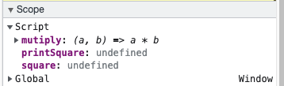

### 为什么是单线程？ 
js的发明的初衷就是作为客户端的脚本进行简单的校验，与用户交互，操作DOM。决定了只能是单线程。H5中允许开启web worker子线程，不可以操作DOM，受控于主线程。

### 任务队列
one thread == one call stack == one thing at a time
主线程之外，有一个任务队列，只要异步任务有了运行结果，就在任务队列中放置一个事件。任务队列是一个事件队列 （可以看成是消息队列）
主线程不断的从 “任务队列” 中读取事件，这个过程是循环不断的。
```js
const mutiply = (a,b) => a * b;
const square = n => mutiply(n,n);
const printSquare = (n) => {
    const squared = square(n);
    console.log(squared);
} 
printSquare(4)
```


#### what happens when things are slow? like fetching data, network, image loading

## 异步常见的场景

1. 网络 ajax fetch
2. IO readFile readdir
3. 定时函数 setTimeout/setInterval

