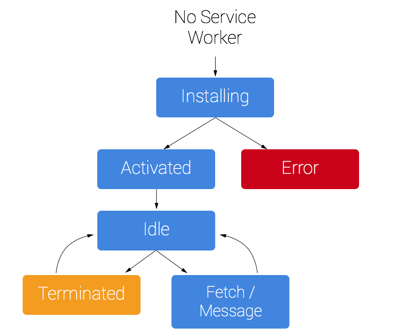

Service Worker 相关注意事项:

- 它是一种 JavaScript Worker，无法直接访问 DOM。 Service Worker 通过响应 postMessage 接口发送的消息来与其控制的页面通信，页面可在必要时对 DOM 执行操作。
- Service Worker 是一种可编程网络代理，让您能够控制页面所发送网络请求的处理方式。
- Service Worker 在不用时会被中止，并在下次有需要时重启，因此，您不能依赖 Service Worker `onfetch` 和 `onmessage` 处理程序中的全局状态。 如果存在您需要持续保存并在重启后加以重用的信息，Service Worker 可以访问 [IndexedDB API]。
- 支持Promise

完全独立于网页

### 参考资料

- https://developers.google.com/web/fundamentals/primers/service-workers?hl=zh-cn