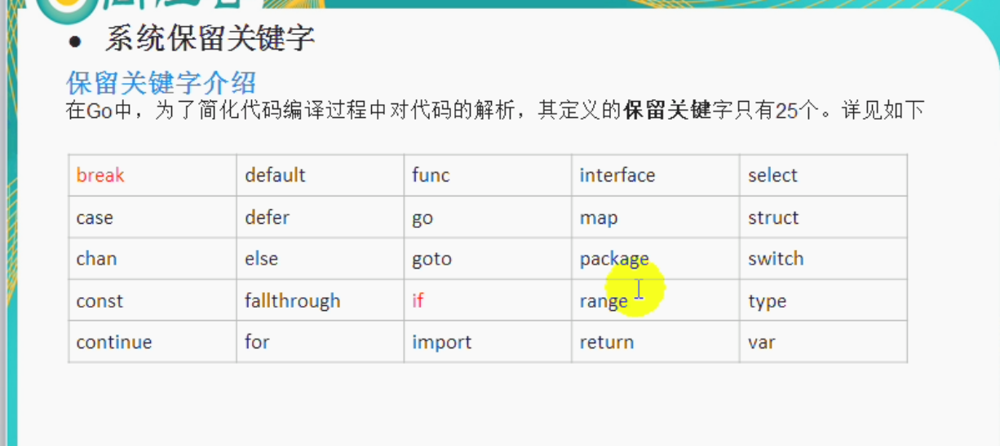

### go的特点：更快，更高效
- expressive,concise,clean, effient
- 并发，很好的利用现代及其的多核，提高运行速度，效率
- 编译快， 高效垃圾回收
- 兼具静态语言和动态语言的特点
- 函数支持多参返回


### go环境
1. **下载对应版本：https://go.dev/doc/install**

**运行下面命令**

```sh
go version # 输出版本号说明安装成功
```
**go的包安装路径的切换**

```sh
# 方法2：设置go proxy.
go env -w GOPROXY=https://goproxy.cn
# 清空缓存 
go clean --modcache
```

2. **开发工具 vscode + 对应go插件**（推荐）


3. https://go.dev/play/

   > 代码交流,: 
   >
   > 将自己的代码写在里面然后生成连接，分享&交流

   ```js
   https://go.dev/play/p/MAohLsrz7JQ?v=gotip
   ```

4. 官方训练场： https://tour.go-zh.org/basics/1

4. go的文档

   > https://pkg.go.dev/fmt#Println
   >
   > 很好的工具

5. **go包的管理**

`go.mod ` 管理包的版本

```sh
go init # 开启新项目
go mod tidy # 安装对应依赖
```

## go的核心

#### 变量的使用

**`-`空白符** 

> 这不仅仅是一个惯例。`_` ，空白标识符，特殊在于实际上返回值并没有赋值。这让你可以一遍又一遍地使用 `_` 而不用管它的类型。

完整的步骤

1. 定义
2. 赋值
3. 使用

```go
var n int
n = 10
fmt.Printf("%d",n)
```

符号`:=`简写这些过程

### 数据类型

栈和堆是逻辑的概念

**值类型**: 变量直接存储值，内存通常（编译逃逸分区）分配在`栈`中

- int系列
- float系列
- bool
- string
- struct
- 数组

**引用类型**：变量存储的是一个地址，真正的数据存储在`堆`中

- 指针
- slice切片
- map
- 管道
- interface

### 保留字



### 运算符

> 运算 赋值 逻辑 比较 逻辑 位运算符 其他运算

**go中的特殊的运算符**（没有三元运算符，使用if.else代替）

- 取地址 `&`

- 取值 `*`

- 空标识符`-` : 忽略某个值


### 位运算

- 原码
- 反码
- 补码

有符号而言，最高位为符号位。

1. 正数的原码，反码，补码都一样
2. 负数的反码 = 它的源码符号位不变，其它位取反
3. 负数的补码 = 它的反码 + 1
4. 0的反码，补码都是0

**计算机在计算的时候都是用补码来计算的。**

**位运算符号**

- `&`

  两个都为1才为1,否则为0

  ```go
  2&3 = 2???
  2 补码 [0000 0010]
  3 补码 [0000 0011]
  			 [0000 0010] = 2
  ```

  

- `|`

  两个中有一个为1，则为1

  ```go
  2&3 = 5
  2 补码 [0000 0010]
  3 补码 [0000 0011]
  			 [0000 0011] = 3
  ```

  

- `^`

  两个一个为0，一个为1，则结果为1，否则为0

  ```go
  2^3 = 5
  2 补码 [0000 0010]
  3 补码 [0000 0011]
  			 [0000 0001] = 1
  ```

- 位移

  ```js
  左移 >> 低位溢出符号位不变
    右移 <<
  ```

  

### 查看数据类型和内存大小

- `fmt.Prinf("%T")`
- `unsafe.Sizeof()` 返回字节数的大小

```go
// 判断数据类型
name := "shit"
fmt.Printf("%T",name) // string

// 查看内存大小
var n1 int64 = 10
// unsafe.Sizeof(n1); 返回占用的字节数
fmt.Printf("%d",unsafe.Sizeof(n1)) // 8
```

**程序运行中在符合业务需求下尽量使用占空间小的数据类型**


### 进制

- 二进制 
- 八进制
- 十六进制
- 十进制

### 组合的坚定支持者

许多人认为它是一种更好的组织代码的方式。当使用继承的时候，你的类和超类紧密耦合在一起，你最终专注于结构而不是行为。

本文章首发在 [LearnKu.com](https://learnku.com/) 网站上。

专注于行为

定义`Person`类型的结构体

```go
type Person struct {
  Name string
  Age byte
}
```

结构体上的函数	

指针接收者

```go
func (p *Person) AddAge() {
  p.Age += 10
}	
```

### 程序流程控制

1. 顺序控制

   没有控制，从上到下执行代码

2. 分支控制

   ```go
   if condition1 {
     // do something
   } else if condition2 {
     
   } else {
     
   }
   ```

   switch...case.. 不用带break,default不是必须的，switch后面也可以不带表达式.

   `fallthrough` 穿透，执行下面的语句

   ```go
   switch 表达式1 {
     case 表达式2:
     // do something
   case 表达式3 :
     // do something
   }
   ```

   ```js
   switch {
     case 表达式1:
       // do something
     case 表达式2: 
       // do something
   }
   ```

   Type switch

   ```go
   var y = 10,0
   switch i := y.(type) {
   case nil:
   case int:
     case float64:
     case bool,string:
   }
   ```

   

3. 循环控制

   `for-range`

   ```go
   for..range
   ```

   `for-len`

   ```go
   for i := 0; i<= len(nums); i++ {
   }
   ```

   

### 指针

1. 基本数据类型中变量存的就是值，也叫做值类型
2. 获取变量的地址`&`
3. 指针类型，变量存的是一个地址，这个`地址指向的空间才是值`
4. 案例

```go
var num int = 1
// 声明一个指针变量，存入变量i的地址
var ptr * int = &i
fmt.Println("num地址 = ",&i)

var i int = 1
fmt.Println("address of i = ",&i)

var ptr *int = &i
fmt.Println("value of ptr = ",ptr)
fmt.Println("address of ptr",&ptr)
```


**获取指针指向的值**

```go
fmt.Println(*ptr) // 10
```

**注意事项**

1. 值类型都有对应的指针，形式为`*值类型`	
2. 值类型包括,基本数据类型： int系列，float系列，bool,string,数组，结构体

一个指针就是内存中的一个地址；指针的值就是实际值的地址。这是间接地获取值的方式。形象地来说，指针和实际值的关系就相当于房子和指向该房子的方向之间的关系。

go函数的传参 : 镜像复制 （赋值值）

`&` 取地址符

```go
p := Perons{"bob",20}
// 所以这个副本值也是一个与原值相等的地址，这就是我们间接传值的方式。
Super(&p)
```


`*` 指针

> `*Person` 表示：指向类型Person的指针

```go
func Super(p *Person) {
}
```


同样很明显的是，复制一个指针比复制一个复杂的结构的消耗小多了。

在 64 位的机器上面，一个指针占据 64 bit 的空间。如果我们有一个包含很多字段的结构，创建它的副本将会是一个很昂贵的操作。指针的真正价值在于能够分享它所指向的值。


### new分配内存

>  `new(X)` 的结果与 `&X{}` 相同。

```go
type Saiyan struct {
  Name string
  Power int
}
```


```go
// 第一方式
goku := new(Saiyan)
goku.Name = "Bob"
goku.Power = 9999

// 等价
goku := &Saiyan{"Evan",99999}
```


> https://learnku.com/docs/the-little-go-book/composition/3310


# 数组和Slice

### 数组

>  存放多个同一数据类型的数据。数组时**值类型**（传参直接复制，符合值类型，值传递的特点）

数组内存： 地址取值

Arrays

```go
// 长度固定了 10 个 int, 按顺序初始化
var scores [10] int

nums := [4] int {1,1,2,4}
```

遍历 `range`

```go
for index,value := range scores {
  // index 数组的下标
  // value 数组的元素
}
for _,value := range scores {
  
}
```

`for`遍历

```go
for i := 0; i < len(nums); i++ {
}
```


数组非常高效但是很**死板**。很多时候，我们在事前并不知道数组的长度是多少。针对这个情况，slices （切片） 出来了。

本文章首发在 [LearnKu.com](https://learnku.com/) 网站上。


### Slice ???? 不是很了解

> 切片是轻量的包含并表示数组的一部分的结构。

- 长度 len

- 容量 cap

```go
// 长度是10,容量是10
	scores := make([]int, 10)

// 长度为0，容量是 10
scores := make([]int,0,10)
```

append 是相当特别的。如果底层数组满了，它将创建一个更大的数组并且复制所有原切片中的值（这个就很像动态语言 PHP，Python，Ruby，JavaScript 的工作方式）。这就是为什么上面的例子中我们必须重新将 append 返回的值赋值给 scores 变量：append 可能在原有底层数组空间不足的情况下创建了新值

**切片初始化**

```go
names := []string {"hello","world"}
checks := make([]bool,10)
var names []string
scores := make([]int,0,20)
```

切片是数组的包装


### 映射

键值对

```go
lookup := make(map[string]int)
```

- len 返回键值对的数目

- delete

  ```go
  delete(lookup,"goku")
  ```

- 迭代 `for-range`

  ```go
  for key,value := range lookup {
  }
  ```


## 包管理

需要注意包名和文件夹名是一样的。而且很明显我们实际并没有连接数据库。这里使用这个例子只是为了展示如何组织代码。


Go 用了一个简单的规则去定义什么类型和函数可以包外可见。如果类型或者函数名称以一个大写字母开始，它就具有了包外可见性。如果以一个小写字母开始，它就不可以。


### 接口


### defer调用

defer调用

- 确保在函数结束的时候执行

- `defer`调用先进后出，使用栈来管理。
- 被调用的函数中的参数在defer的时候被计算

`panic`也不会阻断defer执行

### 常见的调用情况

```go
Open/Close
Lock/Unlock
PrintHeader/PrintFooter
```


带`buffer`, 先写入内存，到达一定的是哦

