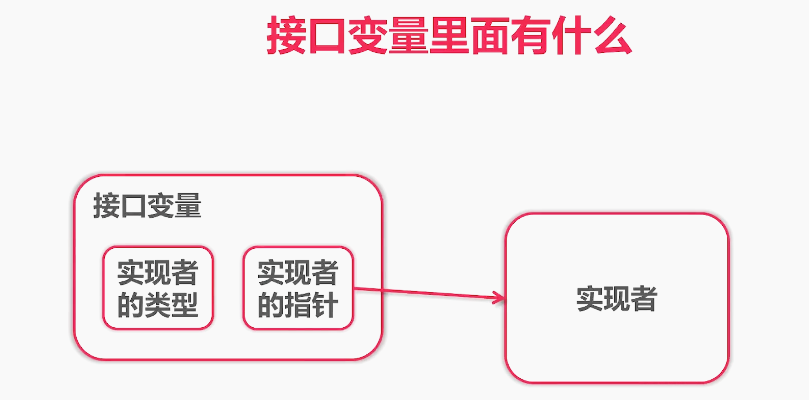

### 工程

- 模块化

- 可配置化

- 可测试

### go中的包

- **大写的默认可以包外可见**
- 小写的包内可见

### 接口的概念

描述事物的外部行为，而非内部结构，结构化类型系统 duck typing

- 强类型
- 弱类型 :少有接口的概念

### 不理解的处

1. `defer`？？


面向接口编程

```go
package main

import (
	"fmt"
	"gomodtest/testing"
)

// 面向接口编程
// something that can get
type retriever interface {
	Get(url string) string
}

// 解耦 testing和infra, 让其可配置化
func getRetriever() retriever {
	// return infra.Retriever{}
	return testing.Retriever{}
}

func main() {
	var r retriever = getRetriever()
	url := "https://www.imooc.com"
	fmt.Printf("%s\n", r.Get(url))
}

```

infra

```go
package infra

import (
	"io/ioutil"
	"net/http"
)

type Retriever struct{}

func (r Retriever) Get(url string) string {
	resp, err := http.Get(url)
	if err != nil {
		panic(err)
	}
	defer resp.Body.Close()
	bytes, _ := ioutil.ReadAll(resp.Body)
	return string(bytes)
}

```

testing

```go
package testing

type Retriever struct {
}

func (r Retriever) Get(url string) string {
	return "fake string"
}

```

同时需要 Readable, Appendable

- 使用者

- 实现者

关于接口的实现

- 接口的实现是隐式的

- 只要实现了接口中的方法即认为实现了接口


### 类型断言

```go	
```



### 接口组合

### 常见系统接口

