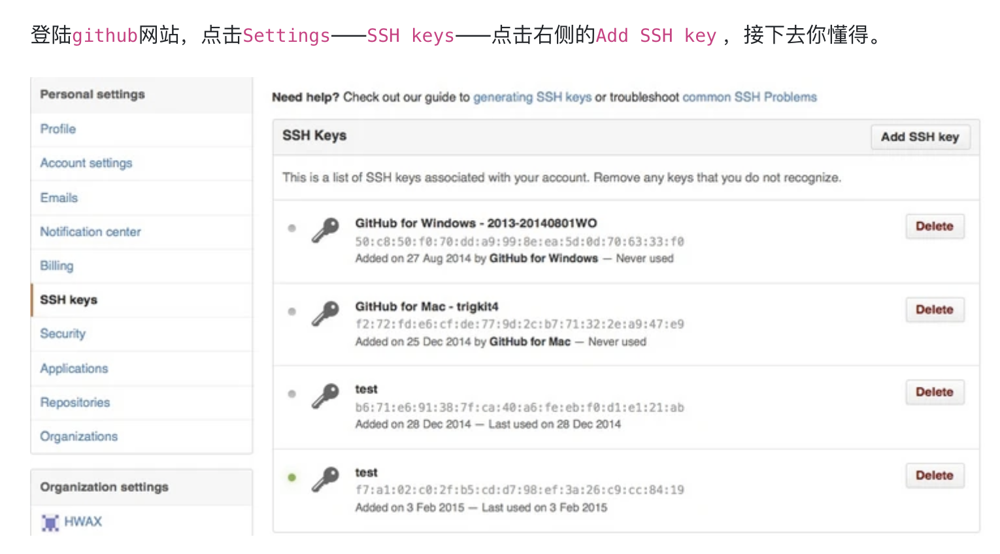
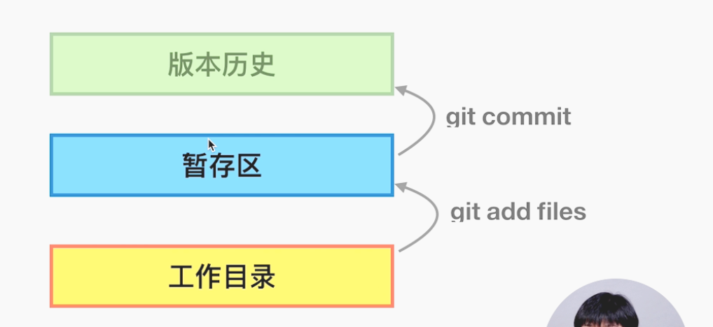

# git 

### git的本地配置
步骤一：本地机器生成公钥，并将公钥上传至GitHub

```sh
ssh-keygen -t rsa -C "git账户上的邮箱"
cat ~/.ssh/id_rsa.pub
# 复制输出的内容到GitHub上去

```



步骤二： 验证登入github
```sh
ssh -T git@github.com
# Hi suckitfa! You've successfully authenticated, but GitHub does not provide shell access.
```

接下来就可以开启你的git之路了


### git的一些简单操作

1. 配置用户的信息 (user,email)
配置信息的范围
- `local`  当前项目, git仓库
- `global` 全局，当前机器上的所有git仓库
- `system`
```js
git config --global user.name "your_name"
git config --global user.email "your_email"
```

### 初始化git
```sh
git init
cd .git 
```

### 加入文件
```sh
git add <filename>
git commit -m "commit message"
git log # 查看提交历史
```


### git的工作方式
- 工作目录
- stage 暂存区
- index



