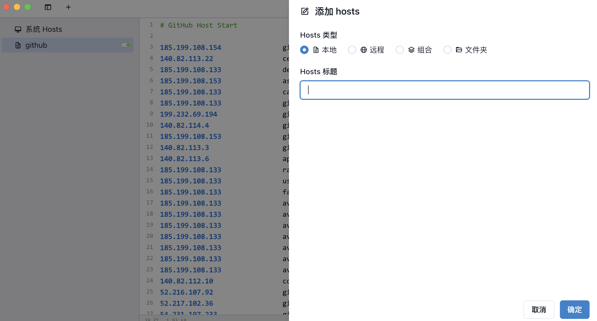
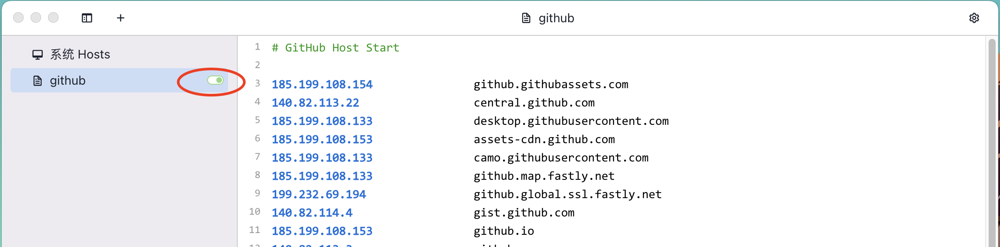
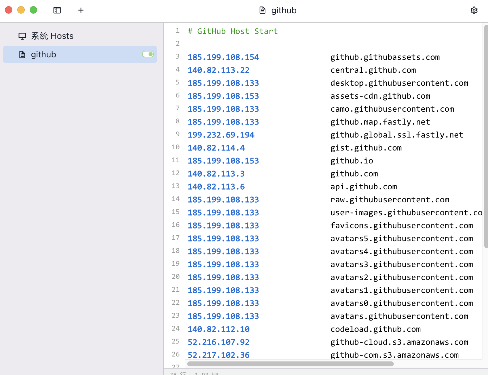
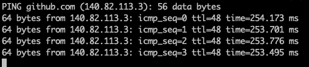

# SwitchHosts

为啥使用该软件?

- 可以让开发者方便的修改本地的hosts文件。

该软件的原理：由于github.com在大陆地区的DNS解析慢，我们修改本地的hosts文件，当解析的时候，直接使用本地的DNS配置， 因此获取github.com正确的ip是非常重要的。而该软件修改系统中/etc/hosts文件(当然我们也可以手动修改，使用这个软件只是更方便而已)，方便我们管理。

#### 使用方法

1. 下载软件并安装好

   > switch的下载地址:https://swh.app/

2. 添加hosts内容

   >  https://gitee.com/isevenluo/github-hosts/raw/master/hosts
   >
   > 打开上面链接，赋值内容到剪切板 （github服务器的ip地址和域名映射）
   >
   > 然后新建hostst文件以追加的方式复制到该软件

3. 开启软件即可

5. 测试效果

