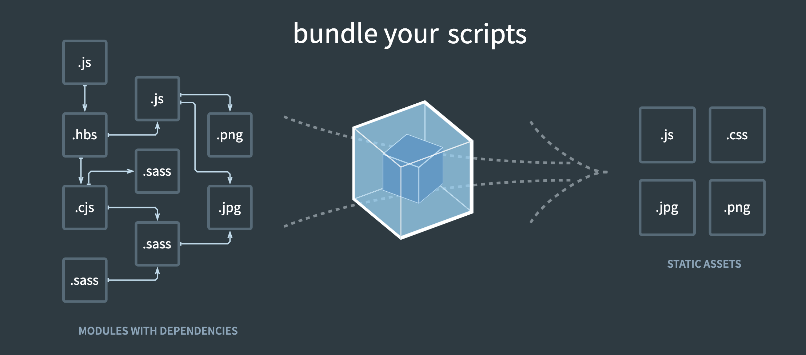

# wepback
### 安装webpack
```sh
# 安装 webpack 和 webpack-cli命令行工具
npm install webpack webpack-cli --save-dev
# 本地开发服务器，提供热更新等功能
npm install webpack-dev-server --save-dev

# --save-dev 将资源放在开发环境中 , devDependency中
```
简单的打包命令的配置

`package.json`

一般工程源码放在目录`src`,输出源码放在 目录`dist`

webpack默认入口为`/src/index.js`

```js
"scripts": {
        "build": "npx webpack --entry=./src/index.js --output-filename=bundle.js --mode=development"
    },
```

- output path使用绝对路径

### webpack

> 一切都是模块
>
> loader从后面向前执行



- webpack.common.js
- webpack.dev.js
- webpack.prod.js


1. **处理css**

loader从后面往前执行，css-loader解析css,style-loader插入页面

```js
{
  test:/\.css$/,
    // loader从后面往前执行，css-loader解析css,style-loader插入页面
  loader:['style-loader','css-loader','postcss-loader']
}
```

2. **处理less,sess**

less-loader,sess-loader

3. 处理图片

**开发环境**

**生产环境**

- 可以做一些webpack的配置优化

```js
{
  test: /\.(png|jpg|jpeg|gif)$/,
   use: {
     loader:'url-loader',
       options:{
         // 小于5KB的图片使用base64格式产出
         // 否则，依然使用file-loader形式，产出url格式
         limits:5*1024,
           outputPath:'/img1/'
       }
   }
}
```


`postcss.config.js`

```js
module.exports = {
  plugins:[require('autoprefixer')]
}
```


### babel

`.babelrc`

```js
{
  "presets":["@babel/preset-env"],
    "plugins":[]
}
```

