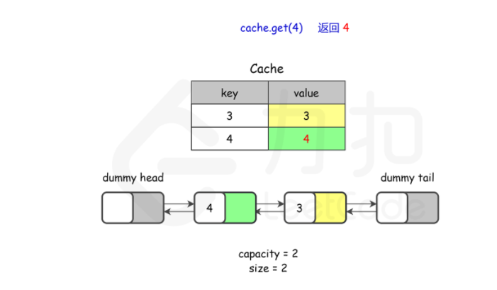

# LRU



1. 哈希：get, put  `O(1)`
2. 双向链表保持顺序

```java
class LRUCache {
    private HashMap<Integer,Node> map;
    private DoubleList cache;
    private int cap;

    public LRUCache(int capacity) {
        this.cap = capacity;
        map = new HashMap<>();
        cache = new DoubleList();
    }
    
    public int get(int key) {
        if(!map.containsKey(key)) return -1;
        makeRecently(key);
        return map.get(key).val;
    }
    
    public void put(int key, int value) {
        if(map.containsKey(key)) {
            deleteKey(key);
            addRecently(key,value);
            return ;
        }
        if(cap == cache.size()) {
            removeLeastRecently();
        }
        addRecently(key,value);
    }

    private void makeRecently(int key) {
        Node x = map.get(key);
        cache.remove(x);
        cache.addLast(x);
    }

    private void addRecently(int key,int val) {
        Node x = new Node(key,val);
        cache.addLast(x);
        map.put(key,x);
    }

    private void deleteKey(int key) {
        Node x = map.get(key);
        cache.remove(x);
        map.remove(key);
    }

    private void removeLeastRecently() {
        Node deleteNode = cache.removeFirst();
        int deleteKey = deleteNode.key;
        map.remove(deleteKey);
    }
}

/**
 * Your LRUCache object will be instantiated and called as such:
 * LRUCache obj = new LRUCache(capacity);
 * int param_1 = obj.get(key);
 * obj.put(key,value);
 */

 class Node {
     public int key,val;
     public Node next,prev;
     public Node(int k,int v) {
         this.key = k;
         this.val = v;
     }
 }

 class DoubleList {
     private Node head,tail;
     private int size;

     public DoubleList() {
         head = new Node(0,0);
         tail = new Node(0,0);
         head.next = tail;
         tail.prev = head;
         size = 0;
     }
     public void addLast(Node x) {
         x.prev = tail.prev;
         x.next = tail;
         tail.prev.next = x;
         tail.prev  = x;
         size ++;
     }

     public void remove(Node x) {
         x.prev.next = x.next;
         x.next.prev = x.prev;
         size --;
     }

     public Node removeFirst( ) {
         if(head.next == tail) {
             return null;
         }
         Node first = head.next;
         remove(first);
         return first;
     }
     public int size() {
         return size;
     }
 }
```