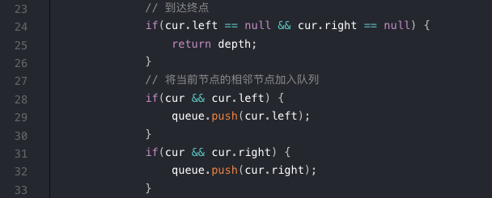
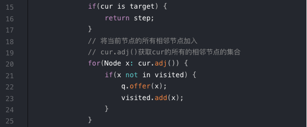

### BFS
队列
```cpp
// 计算从start到target的最短距离
int BFS(Node start, Node target) {
    Queue<Node> q;
    Set<Node> visited;

    q.offer(start);
    visited.add(start);
    int step = 0;

    while(q not empty) {
        int sz = q.size();

        for(int i = 0; i < sz; i++) {
            Node cur = q.poll();
            if(cur is target) {
                return step;
            }
            // 将当前节点的所有相邻节点加入
            // cur.adj()获取cur的所有的相邻节点的集合
            for(Node x: cur.adj()) {
                if(x not in visited) {
                    q.offer(x);
                    visited.add(x);
                }
            }
        }
        step ++;
    }
}
```

```js
/**
 * Definition for a binary tree node.
 * function TreeNode(val, left, right) {
 *     this.val = (val===undefined ? 0 : val)
 *     this.left = (left===undefined ? null : left)
 *     this.right = (right===undefined ? null : right)
 * }
 */
/**
 * @param {TreeNode} root
 * @return {number}
 */
var minDepth = function(root) {
    if(root == null) return 0;
    const queue = [];
    queue.push(root);
    let depth = 1;
    while(queue.length !== 0) {
        let sz = queue.length;
        // 开始遍历层
        for(let i = 0; i < sz; i++) {
            let cur = queue.shift();
            // 到达终点
            if(cur.left == null && cur.right == null) {
                return depth;
            }
            // 将当前节点的相邻节点加入队列
            if(cur && cur.left) {
                queue.push(cur.left);
            }
            if(cur && cur.right) {
                queue.push(cur.right);
            }
        }
        depth ++;
    }
    return depth;
};  
```
BFS中，depth每增加1，队列中的所有节点(当前层次中的所有相邻节点)都向前迈进一步，保证了一旦找到一个总店，走的步数是最少的。

**不同题目中的 "终点" 和 “相邻节点”的具体定义不同**

求的深度二叉树



通用的BFS



###  剑指 Offer II 109. 开密码锁
> 将不同位置的上下变化 “1 ” 看成相邻节点
> 技巧，采用双向BFS,以target作为另外一个开头

### 总结
BFS适合用力找最短路径, 二叉树的最短高度（起点：root，终点:叶子节点)