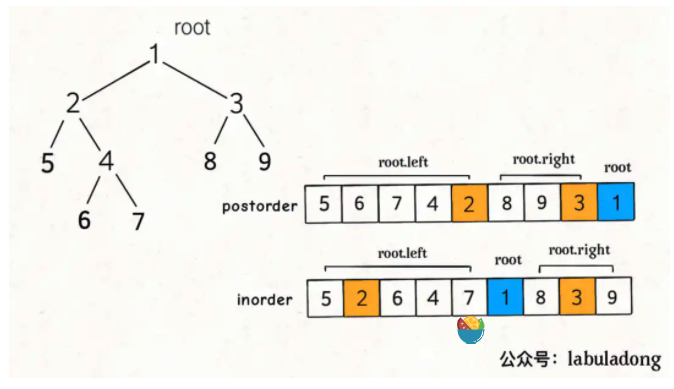

### 二叉树
- leaf nodes: no chilren
- Full Tree: do have children, must have two children
- complete tree:
- perfect tree:
 ### 二叉搜索树 BST
> 一个二叉树中，任意节点的值要大于等于左子树的所有节点的值，且要小于等于右子树所有节点的值。

### 三大遍历


- 前序nlr
```js
function traverse(root) {
    // 前序遍历
    traverse(root.left);
    traverse(root.right);
}
```
- 中序lnr
```js
function traverse(root) {
    traverse(root.left);
    // 中序遍历
    traverse(root.right);
}
```
- 后序lrn
```js
function traverse(root) {
    traverse(root.left);
    traverse(root.right);
    // 后序遍历
}
```
### 三大遍历框架代码

> 明确当前节点要做的事情，剩下的交给框架
```js
function traverse(root) {
    // root需要做什么？
    // 前序遍历
    traverse(root.left);
    // 中序遍历
    traverse(root.right);
    // 后续遍历
}
```

### 关于二叉树的题目
> 递归算法的关键要明确函数的定义，相信这个定义，而不要跳进递归细节。
> 写二叉树的算法题，都是基于递归框架的，我们先要搞清楚root节点它自己要做什么，然后根据题目要求选择使用前序，中序，后续的递归框架。
> 二叉树题目的难点在于如何通过题目的要求思考出每一个节点需要做什么，这个只能通过多刷题进行练习了。
> 如果本文讲的三道题对你有一些启发，请三连，数据好的话东哥下次再来一波手把手刷题文，你很快就会发现二叉树的题真的是越刷越顺手，欲罢不能，恨不得一口气把二叉树的题刷通。


### 计算二叉树的节点个数
> https://leetcode-cn.com/problems/count-complete-tree-nodes/
- `countNodes`定义：返回以当前节点为根节点的树的节点个数。
- 当前节点的操作: 当前节点（1）和当前节点的左`countNodes(root.left)`右`countNodes(root.right)`子树的节点之和。
```js
function countNodes(root) {
    if(root == null) return 0;
    return 1 + countNodes(root.left) + countNodes(root.right);
}
```

### 226. 反转二叉树
```js
const invertTree = (root) => {
    if(root == null) return null;
    const tmp = root.left;
    root.left = root.right;
    root.right = tmp;
    invertTree(root.left);
    invertTree(root.right);
    return root;
}
```
###  flatten二叉树
```js
/**
 * Definition for a binary tree node.
 * function TreeNode(val, left, right) {
 *     this.val = (val===undefined ? 0 : val)
 *     this.left = (left===undefined ? null : left)
 *     this.right = (right===undefined ? null : right)
 * }
 */
/**
 * @param {TreeNode} root
 * @return {void} Do not return anything, modify root in-place instead.
 */
var flatten = function(root) {
    // base case;
    if(root == null) {
        return ;
    }

    flatten(root.left);
    flatten(root.right);
    // 后序遍历的位置左右子树已经被拉平了
    let left = root.left;
    let right = root.right;
    // 将左子树作为右子树
    root.left = null;
    root.right = left;
    // 将原先的右子树接到当前右子树的末端
    let p = root;
    // 移动到末端
    while(p.right != null) {
        p = p.right;
    }
    // 接入当前的右子树
    p.right = right;
};
```
### 116. 填充每个节点的下一个右侧节点指针
```js
/**
 * // Definition for a Node.
 * function Node(val, left, right, next) {
 *    this.val = val === undefined ? null : val;
 *    this.left = left === undefined ? null : left;
 *    this.right = right === undefined ? null : right;
 *    this.next = next === undefined ? null : next;
 * };
 */

/**
 * @param {Node} root
 * @return {Node}
 */
var connect = function(root) {
    if(root == null) return null;
    connectTwoNodes(root.left,root.right)
    return root;
}
function connectTwoNodes(node1,node2) {
    if(node1 == null || node2 == null) return;

    // 传入的两个节点进行连接
    node1.next = node2;
    // 连接两个同父节点的两个节点
    connectTwoNodes(node1.left,node1.right);
    connectTwoNodes(node2.left,node2.right);
    // 连接跨越父节点的连个节点
    connectTwoNodes(node1.right,node2.left);
}
```
### 654.构建最大的二叉树
- 
```js
/**
 * Definition for a binary tree node.
 * function TreeNode(val, left, right) {
 *     this.val = (val===undefined ? 0 : val)
 *     this.left = (left===undefined ? null : left)
 *     this.right = (right===undefined ? null : right)
 * }
 */
/**
 * @param {number[]} nums
 * @return {TreeNode}
 */
var constructMaximumBinaryTree = function(nums) {
    if(nums.length == 0) return null;
    return build(nums,0,nums.length-1);
};

function build(nums,low,high) {
    if(low > high) {
        return null;
    }

    let maxValIndex = 0;
    let maxVal = Number.MIN_SAFE_INTEGER
    for(let i = low; i <= high; i++) {
        if(nums[i] > maxVal) {
            maxVal = nums[i];
            maxValIndex = i;
        }
    }
    let root = new TreeNode(maxVal);
    root.left = build(nums,low,maxValIndex - 1);
    root.right = build(nums,maxValIndex + 1, high);
    return root;
}
```
### 105. 根据前序和中序遍历构造出二叉树


把根节点做出来，然后递归构造左右子树即可。

>  关键知道：当前节点该做什么？ 也就是三大框架，前中后
我如何才能知道以自己为根的二叉树长啥样？
其实看到这个问题，就可以判断本题要使用「后序遍历」框架来解决：

```cpp
void traverse(TreeNode root) {
    traverse(root.left);
    traverse(root.right);
    /* 解法代码的位置 */
}
```js
/**
 * Definition for a binary tree node.
 * function TreeNode(val, left, right) {
 *     this.val = (val===undefined ? 0 : val)
 *     this.left = (left===undefined ? null : left)
 *     this.right = (right===undefined ? null : right)
 * }
 */
/**
 * @param {number[]} preorder
 * @param {number[]} inorder
 * @return {TreeNode}
 */
var buildTree = function(preorder, inorder) {
    return build(preorder,0,preorder.length-1,inorder,0,inorder.length-1);
};
function build(preorder,preStart,preEnd,inorder,inStart,inEnd) {
    if(preStart > preEnd) {
        return null;
    }
    let rootVal = preorder[preStart];
    let index = 0;
    for(let i = inStart; i <= inEnd; i++) {
        if(inorder[i] === rootVal) {
            index = i;
            break;
        }
    }
    let leftSize = index - inStart;
    let root = new TreeNode(rootVal);
    root.left = build(preorder,preStart+1,preStart+leftSize,inorder,inStart,index - 1);
    root.right = build(preorder,preStart+leftSize+1,preEnd,inorder,index+1,inEnd);
    return root;
}
```
### 106. 从中序与后序遍历序列构造二叉树



```js
/**
 * Definition for a binary tree node.
 * function TreeNode(val, left, right) {
 *     this.val = (val===undefined ? 0 : val)
 *     this.left = (left===undefined ? null : left)
 *     this.right = (right===undefined ? null : right)
 * }
 */
/**
 * @param {number[]} inorder
 * @param {number[]} postorder
 * @return {TreeNode}
 */
var buildTree = function(inorder, postorder) {
    return build(inorder,0,inorder.length-1,postorder,0,postorder.length-1);
};

function build(inorder,inStart,inEnd,postorder,postStart,postEnd) {
    if(postStart > postEnd) {
        return null;
    }
    let rootVal = postorder[postEnd];
    let index = 0;
    for(let i = inStart; i<= inEnd; i++) {
        if(inorder[i] === rootVal) {
            index = i;
            break;
        }
    }
    let leftSize = index - inStart;
    let root = new TreeNode(rootVal);
    root.left = build(inorder,inStart,index-1,postorder,postStart,postStart+leftSize-1);
    root.right = build(inorder,index+1,inEnd,postorder,postStart+leftSize,postEnd-1);
    return root;
}
```
```
为什么？很简单呀，我要知道以自己为根的子树长啥样，是不是得先知道我的左右子树长啥样，再加上自己，就构成了整棵子树的样子？

```java
/**
 * Definition for a binary tree node.
 * public class TreeNode {
 *     int val;
 *     TreeNode left;
 *     TreeNode right;
 *     TreeNode() {}
 *     TreeNode(int val) { this.val = val; }
 *     TreeNode(int val, TreeNode left, TreeNode right) {
 *         this.val = val;
 *         this.left = left;
 *         this.right = right;
 *     }
 * }
 */
class Solution {
    // 结果集
    LinkedList<TreeNode> res = new LinkedList();
    // 记录每个子树出现的次数
    HashMap<String,Integer> memo = new HashMap();

    public List<TreeNode> findDuplicateSubtrees(TreeNode root) {
        traverse(root);
        return res;
    }
    String traverse(TreeNode root) {
        if(root == null) {
            return "#";
        }

        String left = traverse(root.left);
        String right = traverse(root.right);

        String subtree = left + "," + right + "," + root.val;
        int freq = memo.getOrDefault(subtree,0);
        if(freq == 1) {
            res.add(root);
        }
        memo.put(subtree,freq+1);
        return subtree;

    }
}
```

### 222. 完全二叉树的节点个数:求二叉树的节点个数
> https://leetcode-cn.com/problems/count-complete-tree-nodes/
```js
function height(root) {
    if(root == null) return 0;
    return height(root.left) + height(root.right) + 1;
}
```
### 二叉树的深度
> 思考：为什么要使用后序遍历的框架?
> 二叉树的深度：当前节点 1 + 左右子树最大的深度 ===> 因此必须要先知道当前接地那左右子树的深度才可以计算以当前节点为根的树的深度。所以使用：后序遍历框架
```js
function depth(root) {
    if(root == null) return 0;
    let left = depth(root.left);
    let right = depth(root.right);
    return Math.max(left,right) +1;
}
```
### 剑指 Offer 55 - II. 平衡二叉树:是否为平衡二叉树
> https://leetcode-cn.com/problems/ping-heng-er-cha-shu-lcof/
```js
function depth(root) {
    if(root == null) return 0;
    return Math.max(depth(root.left),depth(root.right)) + 1;
}
function isBalanced(root) {
    if(root == null) return true;
    return Math.abs(depth(root.left) - depth(root.right)) <= 1 &&
    isBalanced(root.left) &&
    isBalanced(root.right);
}
```


#### 剑指 Offer 37. 序列化二叉树
> https://leetcode-cn.com/problems/xu-lie-hua-er-cha-shu-lcof/
实际是考察二叉树的遍历方式:
- 三大遍历解法 (以前序遍历为例子)
- 层级遍历解法(BFS)
```js
/**
 * Definition for a binary tree node.
 * function TreeNode(val) {
 *     this.val = val;
 *     this.left = this.right = null;
 * }
 */

/**
 * Encodes a tree to a single string.
 *
 * @param {TreeNode} root
 * @return {string}
 */
var serialize = function(root) {
    const res = [];
    serializeHelper(root,res);
    // 使用符号','分割每个节点
    return res.join(',');
};

function serializeHelper(root,res) {
    if(root == null) {
        res.push('#');
        return;
    }

    // 前序遍历的
    res.push(root.val);
    serializeHelper(root.left,res);
    serializeHelper(root.right,res);
}

/**
 * Decodes your encoded data to tree.
 *
 * @param {string} data
 * @return {TreeNode}
 */
var  deserialize = function(data) {
    const nodes = data.split(',');
    return deserializeHelper(nodes)
};

function deserializeHelper(nodes) {
    if(nodes.length === 0) return null;
    const first = nodes.shift();
    if(first === '#') return null;
    const root = new TreeNode(first);
    root.left = deserializeHelper(nodes);
    root.right = deserializeHelper(nodes);
    return root;
}
/**
 * Your functions will be called as such:
 * deserialize(serialize(root));
 */
```