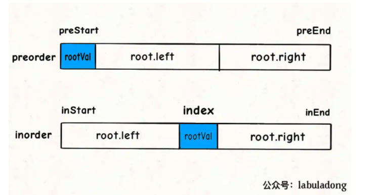

### 二叉树
- leaf nodes: no chilren
- Full Tree: do have children, must have two children
- complete tree:
- perfect tree:


### 三大遍历



- 前序nlr
```js
function traverse(root) {
    // 前序遍历
    traverse(root.left);
    traverse(root.right);
}
```
- 中序lnr
```js
function traverse(root) {
    traverse(root.left);
    // 中序遍历
    traverse(root.right);
}
```
- 后序lrn
```js
function traverse(root) {
    traverse(root.left);
    traverse(root.right);
    // 后序遍历
}
```
### 框架
> 明确当前节点要做的事情，剩下的交给框架
```js
function traverse(root) {
    // root需要做什么？
    // 前序遍历
    traverse(root.left);
    // 中序遍历
    traverse(root.right);
    // 后续遍历
}
```

### 关于二叉树的题目
> 递归算法的关键要明确函数的定义，相信这个定义，而不要跳进递归细节。
> 写二叉树的算法题，都是基于递归框架的，我们先要搞清楚root节点它自己要做什么，然后根据题目要求选择使用前序，中序，后续的递归框架。
> 二叉树题目的难点在于如何通过题目的要求思考出每一个节点需要做什么，这个只能通过多刷题进行练习了。
> 如果本文讲的三道题对你有一些启发，请三连，数据好的话东哥下次再来一波手把手刷题文，你很快就会发现二叉树的题真的是越刷越顺手，欲罢不能，恨不得一口气把二叉树的题刷通。


### 二叉搜索树 BST
> 一个二叉树中，任意节点的值要大于等于左子树的所有节点的值，且要小于等于右子树所有节点的值。

### 确定每一个节点要做的事情
### 反转二叉树 226
```js
const invertTree = (root) => {
    if(root == null) return null;
    const tmp = root.left;
    root.left = root.right;
    root.right = tmp;
    invertTree(root.left);
    invertTree(root.right);
    return root;
}
```
###  flatten二叉树，
将二叉树拉平
```js
/**
 * Definition for a binary tree node.
 * function TreeNode(val, left, right) {
 *     this.val = (val===undefined ? 0 : val)
 *     this.left = (left===undefined ? null : left)
 *     this.right = (right===undefined ? null : right)
 * }
 */
/**
 * @param {TreeNode} root
 * @return {void} Do not return anything, modify root in-place instead.
 */
var flatten = function(root) {
    // base case;
    if(root == null) {
        return ;
    }

    flatten(root.left);
    flatten(root.right);
    // 后序遍历的位置左右子树已经被拉平了
    let left = root.left;
    let right = root.right;
    // 将左子树作为右子树
    root.left = null;
    root.right = left;
    // 将原先的右子树接到当前右子树的末端
    let p = root;
    // 移动到末端
    while(p.right != null) {
        p = p.right;
    }
    // 接入当前的右子树
    p.right = right;
};
```


### 根据前序和中序遍历构造出二叉树
把根节点做出来，然后递归构造左右子树即可。


### 
>  关键知道：当前节点该做什么？ 也就是三大框架，前中后
我如何才能知道以自己为根的二叉树长啥样？
其实看到这个问题，就可以判断本题要使用「后序遍历」框架来解决：

```cpp
void traverse(TreeNode root) {
    traverse(root.left);
    traverse(root.right);
    /* 解法代码的位置 */
}
```
为什么？很简单呀，我要知道以自己为根的子树长啥样，是不是得先知道我的左右子树长啥样，再加上自己，就构成了整棵子树的样子？

```java
/**
 * Definition for a binary tree node.
 * public class TreeNode {
 *     int val;
 *     TreeNode left;
 *     TreeNode right;
 *     TreeNode() {}
 *     TreeNode(int val) { this.val = val; }
 *     TreeNode(int val, TreeNode left, TreeNode right) {
 *         this.val = val;
 *         this.left = left;
 *         this.right = right;
 *     }
 * }
 */
class Solution {
    // 结果集
    LinkedList<TreeNode> res = new LinkedList();
    // 记录每个子树出现的次数
    HashMap<String,Integer> memo = new HashMap();

    public List<TreeNode> findDuplicateSubtrees(TreeNode root) {
        traverse(root);
        return res;
    }
    String traverse(TreeNode root) {
        if(root == null) {
            return "#";
        }

        String left = traverse(root.left);
        String right = traverse(root.right);

        String subtree = left + "," + right + "," + root.val;
        int freq = memo.getOrDefault(subtree,0);
        if(freq == 1) {
            res.add(root);
        }
        memo.put(subtree,freq+1);
        return subtree;

    }
}
```


