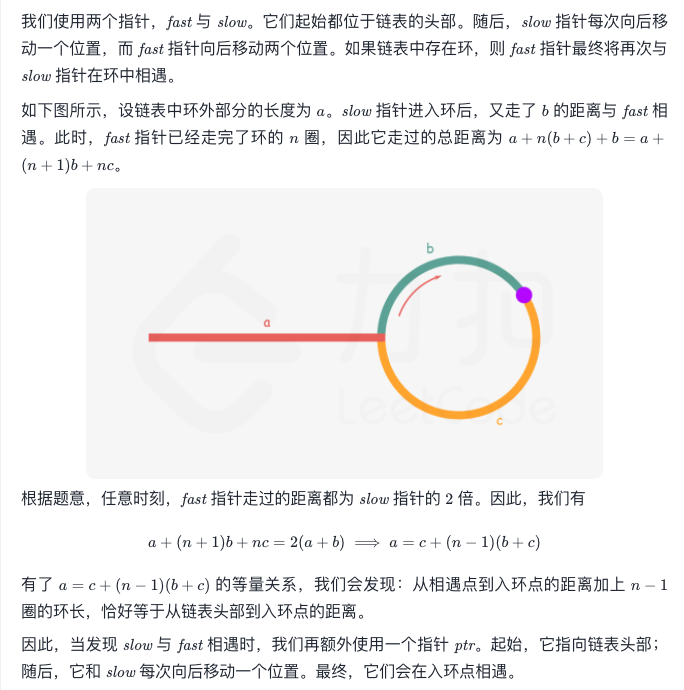

# 双指针

### 快慢指针
- 链表是否有环

```js
function hasCycle(head) {
  let slow = fast = head;
  while(fast != null && fast.next != null) {
    fast = fast.next.next;
    slow = slow.next;
    if(fast == slow) {
      return true;
    }
  }
  return false;
}
```


- 剑指 Offer II 022. 链表中环的入口节点 https://leetcode-cn.com/problems/c32eOV/




- 链表的中点

对链表进行归并排序

```js
function linkedListMiddle(head) {
  let slow = fast = head;
  while(fast != null && fast.next != null) {
    fast = fast.next.next;
    slow = slow.next;
  }
  return slow;
}
```

- 链表的倒数第k个节点

```js
function getKthFromend(head,k) {
  let fast = slow = head;
  while(k-- > 0) {
    fast = fast.next;
  }
  while(fast != null) {
    fast = fast.next;
    slow = slow.next;
  }
  return slow;
}
```

### 左右指针

数组有序

- 二分搜索
- 输入的数组有序，两数之和
- 反转数组

```js
function reverseArr(nums) {
  let left = 0,right = nums.length - 1; //[left,right]
  while(left < right ) {
    let temp = nums[left];
    nums[left] = nums[right];
    nums[right] = temp;
    right--;
    left++;
	}
}
```

