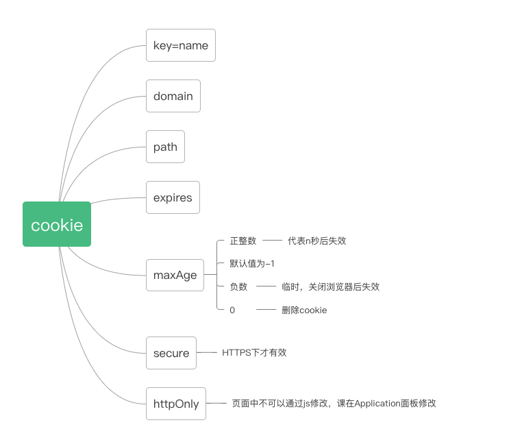
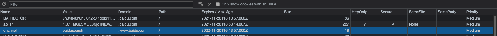

### HTTP Client
- 浏览器
- curl

### 核心
- 缓存策略 （Cache-Control的含义）
- CSP
- Redirect
- 数据协商
- 长连接

### Cookie
通过服务端设置存储在客户端的键值对文本，用来表示客户信息。比如：登入，权限，sessionID等...
常见如下字段

sameSite
- strict
- lax
- None

### session
- 记录服务器和客户端会话状态的机制
- 基于cookie实现，sesson存储在服务器中，sessionID一般存储在cookie中
- sessionID 是连接 Cookie 和 Session 的一道桥梁，大部分系统也是根据此原理 来验证用户登录状态。
