# Linux基础入门
Linux操作系统在计算机系统中的位置， 主要提供的功能
- 系统调用
- 内核： 是其他程序能够运行的基础,实现了许多基础功能： 多任务和硬件管理
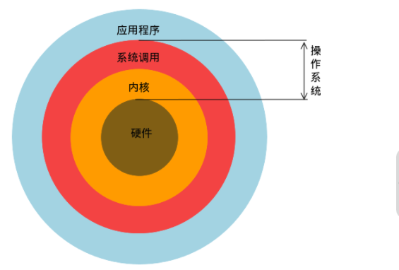
### 课程介绍
- 课程地址:https://www.lanqiao.cn/courses/1/learning/
- 提供完整的实验环境

### 学习路径

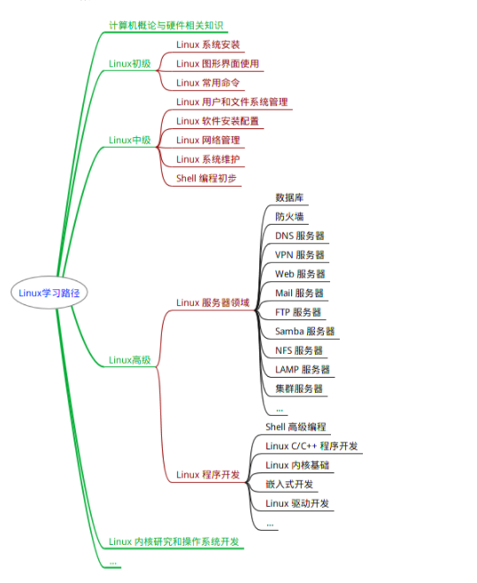

### Linux的桌面环境

基于`x协议`实现的图形界面客户端

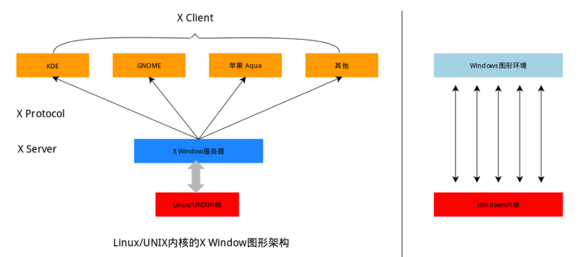

### Linux的基本命令

shell-壳： 有壳就有核。这里的核就是Unix/ Linux内核， shell是指”提供给使用者使用的界面“的软件（命令解释器）隐藏操作系统的底层细节。

- 输入

```sh
touch file
cd /etc/
pwd
```

- 输出

输出会返回你想要的记过，比如你要看文件就会返回文件内容。如果只是执行，执行失败就会告诉你哪里错了。如果执行成功就没有输出： linux哲学：没有结果就是最好的结果

#### 快捷键

- 【tab】自动补全命令：参数，目录等.......
- [ctrl + c] 组合键终止命令
- 【ctrl + a】将光标移动到行头
- 【ctrl + a】将光标移动到行末
- 【ctrl + k】 删除从光标所在的位置到行末
- 历史命令： 方向键：向上
- 通配符： `*` /` `?

| 字符                  | 意义                             |
| --------------------- | -------------------------------- |
| *                     | 匹配0个或者多个                  |
| ?                     | 匹配任意一个字符                 |
| [list]                | 匹配list中的任意一个字符         |
| [^list]               | 匹配除list中的任意一个字符       |
| {c1..c2}              | 匹配c1-c2中的全部字符{1..10}     |
| {string1,string2....} | 匹配string1或string2其中一个字符 |
|                       |                                  |

- 创建多个文件

```sh
touch love_{1..10}_shiyanlou.txt
```

- 查看帮助文档

```sh
man man
```

1. NAME
2. SYNOPSIS
3. DESCRIPTION
4. EXAMPLE
5. SEE ALSO


- banner命令 打印字符

```sh
sudo apt-get update
sudo apt-get install sysvbanner
banner shiyanlou
```


### Linux用户与权限

同一个主机可以由不同的用户登入，他们共享一定的空间，同时又有自己的空间存放各自文件。其实他们在同一个物理磁盘上的甚至同一个逻辑分区或者目录，但是由于Linux的用户管理和权限机制，不同用户不可以轻易查看，和修改彼此的文件。

- 用户管理
- 用户权限

### root

root属于sudo用户组

- 拥有最高权限， 可以对系统中的所有文件执行增删改查操作

```sh
# 增加用户lilei
sudo adduser lilei
# 切换用户
su -l lilie
```

- groups

```sh
# 查看用户组
groups shiyanlou
```

- cat 看看

```sh
# cat命令用于读取制定文件内容打印到终端，|sort表示对文本进行字典排序
cat /etc/group | sort
```

```sh
cat /etc/group | grep -E "shiyanlou"
```

### 将其他用户加入sudo用户组

新建的用户`lilie`使用sudo命令, 显示不在sudoers文件中，意味着不在sudo用户主中，没有root的权限。

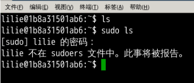

##### 将用户`lilie`加入sudo用户组

```sh
# 切换为用户lilie
su -l lilie
sudo ls
# 切换为root用户才有权限给其他用户修改权限
# 将lilie用户添加到sudo用户组中去
sudo usermod -G sudo lilie
# 查看lilie用户
groups lilie
```

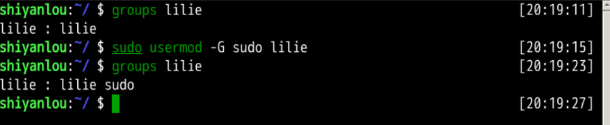

#### 删除用户和用户组

```sh
# 删除用户，同时删除该用户的home目录
sudo deluser lilei --remove-home

# 查看是否有lilei
cat /etc/group | grep "lilei"
```


### 文件的权限

- **Linux中一切皆是文件**

对文件的操作无非就是CURD-- 增加，删除，修改，查找,  不同的用户组对文件的权限对应这不同的权限级别。

- **变更文件的所有者**

```sh
# 切换到shiyanlou用户, 用户执行以下操作
cd /home/lilei
ls iphone11
# 变更文件的所有者
sudo chown shiyanlou iphone11
```

- **文件的权限详细介绍**

**第一种修改文件权限方式**

每个人文件有三组固定的权限

>  拥有者  | 所属用户组 | 其他用户组

每一组权限有如下值

> rwx: 1 1 1 ==> 7
>
> r: 读
>
> w: 写
>
> x：执行

```sh
# 将iphone11文件修改为自己可用: 拥有者: rw: 110 ===> 6 
chmod 600 iphone11
ls -alh iphone11
```

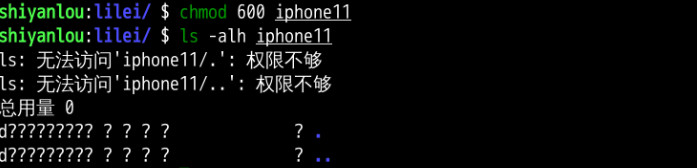

**第二种修改方式**

- g: group 用户组
- o: others 其他用户
- u：user 用户

+ `+` 表示增加， `-`表示去掉

```sh
chmod go-rd iphone11
```

### Linux的目录结构及文件基本操作

**Linux中一切皆是文件**

linux是以目录结构的形式来构建整个系统的，可以理解为树形结构时用户可操作系统的骨架. Windows是以磁盘为主的。

**linux中的目录是磁盘挂载在目录上的。**

- FHS： Filesystem Hierarchy Standard 文件系统层次结构标准. 定义了每个小区域的用途，所需要的最小构成文件和目录同时给出了列娃处理与矛盾处理

```sh
sudo apt-get update
```

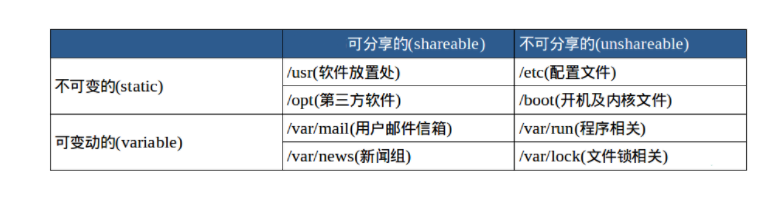


- **路径**

1. `-`表示上次所在的目录
2. `~`home目录
3. `.` 隐藏目录 或文件

```sh
# 显示所有的目录或者文件
ls -a
# 查看当前目录
pwd
```

- 新建文件 touch

**本质上是修改已有文件的时间戳**

```sh
# 创建test文件
# touch 命令的核心就是修改文件的时间戳
touch test
# 创建目录
mkdir -p father/son/grandson
```

- 复制文件

```sh
# 在当前目录下， 移动test文件到 father/son/grandson文件夹下
cp test father/son/grandson
# 文件夹复制，使用参数 -r 表示递归的复制当前文件夹及其里面的内容
mkdir family
# 将father内容复制到 family中
cp -r father family
```

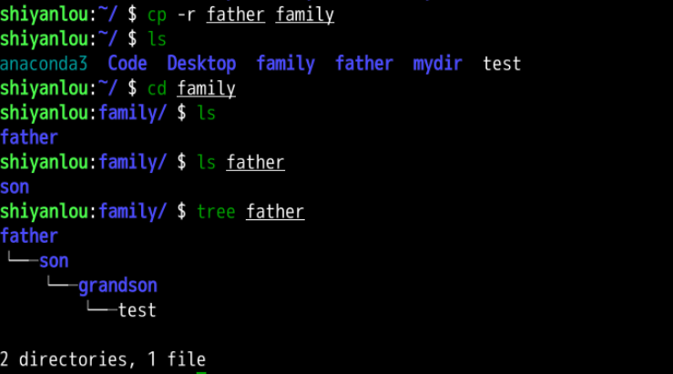

- **删除文件 rm**

**牢牢记住，在Linux系统中，一切都是文件。**

```sh
# 删除test文件
rm test
# 删除目录
rm -r family
# 删除权限不足的文件, 强制删除
rm -rf family
```

- 移动文件 mv： move or rename file

```sh
mkdir Documents
touch file1
# 将file1移动到 Documents文件夹中
mv file1 Documents

# 重命名
cd Documents
# 将file1重命名为file2
mv file1 file2
```

**批量重命名**

```sh
# 添加行号并打印
nl -n passwd
cat -n passwd
```

**使用more和less命令查看分页文件**

>  enter向下滚动一行，h显示帮助, space滚动一屏

```sh
# 分屏显示内容，默认显示一屏幕的内容,底部显示进度条
more passwd
# 
lesss passwd
```

**tail和head查看文件**

```sh
# 显示/etc/passwd文件的后10行
tail /etc/passwd

# 显示/etc/passwd文件的最后一行
tail -n 1 /etc/passwd

# 应用 tail -f 不停地读取某个文件并显示内容,
# 我们可以动态的查看日志，达到实时监控的目的
tail -f 
```

- **查看文件的类型**

**Linux中一切皆是文件。Linux不会根据文件的后缀来识别文件类型。 当你在文件中输入内容后才会显示文件的类型。**

```sh
# 查看文件的类型
file /bin/ls
# 说明该文件是一个可执行文件，运行在64平台上，并使用了动态链接文件.
```

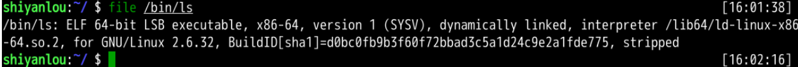

- **文件后台运行**

```sh
# 将xeyes运行在后台
nohup xeyes &
# 输入命令后出现进程号 PID
```

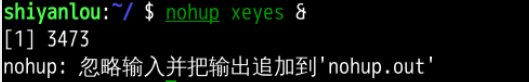

- 杀掉进程

```sh
sudo kill -9 进程号
```

### 环境变量

变量：计算机中记录一个值的符号. 通常变量与值是一一对应的关系.

```sh
# 声明一个变量tmp
declare tmp
# tmp变量赋值
tmp=shiyanlou
# 输出变量中的值, $表示引用一个变量的值.
echo $tmp
```

**引用变量使用符号`$`**

**环境变量**

在所有的UNIX和类UNIX系统中（这里可以认为就是Linux操作系统）, 每个进程都有其搁置的环境变量的设置，且默认情况下，当一个进程被创建的时候，除了创建过程中明确指定的话，它将继承其父进程中的绝大部分环境设置。shell程度作为一个进程运行在操作系统之上，而我们的shell中命令也以shell的子进程方式运行.

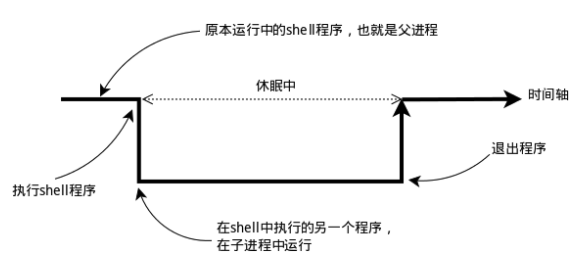

涉及到的变量类型有三种

1. shell进程汇总私有的用户自定义变量
2. shell本身内建的变量
3. 从自定义变量导出的环境变量

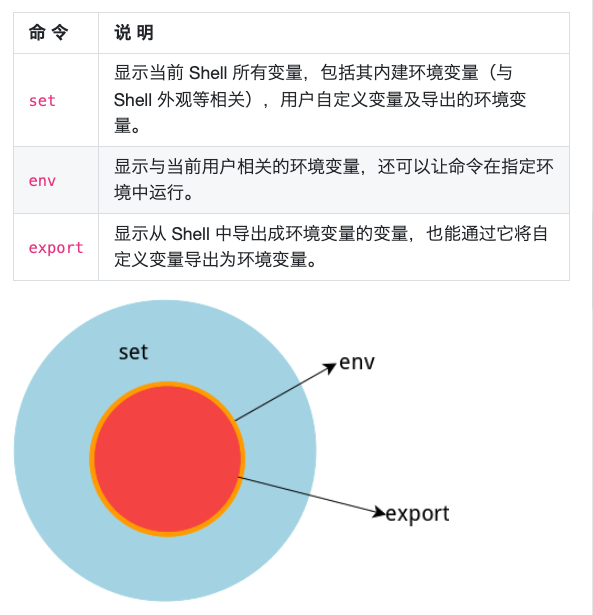

**通过管道|使用sort命令排序**

```sh
temp=shiyanlou
export temp_env=shiyanlou
env|sort>env.txt
export|sort>export.txt
set|sort>set.txt
```

**永久生效**

修改配置文件, 

- `/etc/bashrc` 存放着shell变量
- `/etc/profile` 存放着环境变量

```sh
cd ~
cat .profile
```

- **命令的查找路径与顺序**

  创建文件hello_shell.sh

  ```sh
  for((i=0; i<10; i++));do
  	echo "hello shell"
  done
  exit 0
  ```

  为文件添加执行权限 (Linux系统不是根据文件的后缀名来区分是否可以执行的)

  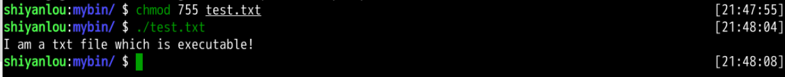

  ```sh
  # 添加执行权限
  chmod 755 hello_shell.sh
  # 执行该文件
  ./hello_shell.sh
  ```

  2. 创建c语言文件 hello_world.c

  ```sh
  gedit hello_world.c
  ```

  编写下面文件

  ```c
  #include<stdio.h>
  int main(void) {
    printf("Hello world!\n");
    return 0;
  }
  ```

  编译链接C语言文件

  ```sh
  # 根据源代码文件hello_world.c 生成 hello_world可执行文件
  gcc -o hello_world hello_world.c
  ```

  **将mybin中的可执行文件加入PATH变量中**

  ```sh
  # 必须使用绝对路径 修改 .zshrc文件
  PATH=$PATH:/home/shiyanlou/mybin
  ```

  > `>` 表示覆盖的方式定向到一个文件
  >
  > `>>`表示追加的方式到一个文件中

- 让环境变量立即生效

```sh
# zshrc表示的使用zsh shell
source ~/.zshrc
```


- 修改和删除已有的变量

```sh
unset myvar
```

- 搜素文件

```sh
whereis who
who
locate
find
# 文件类型
# 文件名
find /etc/ -name interfaces
# 文件属性: 时间戳
```

### 查找文件的应用

1. find
2. chmod
3. chown
4. sudo

知道sources.list在文件夹etc下面, 将文件找出来，并且设置为自己可以访问，但其他用户不可以访问

```sh
# 提供name参数找到文件
sudo find /etc -name sources.list
# 改变文件的所有者为: shiyanlou
sudo chown shiyanlou /etc/apt/sopurces.list
# 修改问价你的访问权限：只可本用户访问
sudo chmod 600 /etc/apt/sources.list
```

### 文件压缩与解压

linux上常用的打包, 解压工具:zip,tar。 理解以下几个关于文件打包压缩的关键字：

1. 打包：个人理解为将多个文件打包成一个。（通常多个文件放在文件夹中,打包后文件夹及其里面的文件成为了一个新的文件）
2. 压缩: 将打包好的文件存储空间压缩,去掉多余的空间。
3. 解压: 将打包压缩好的文件还原成原来的多个文件的。

**总结：由上可知，打包是打包，压缩时压缩。**

### 文件打包压缩常用命令介绍

- zip 

**打包压缩**

```sh
# 切换到目标工作目录
cd /home/shiyanlou
# 将Desktop打包为 shiyanlou.zip
zip -r -q -o shiyanlou.zip /home/shiyanlou/Desktop
# 命令参数解释
# -r : 递归打包文件夹中的文件
# -q: 不向屏幕输出任何内容
# -o: 输出文件

# 查看文件大小
du -h shiyanlou.zip

# 查看文件类型
file shiyanlou.zip
```

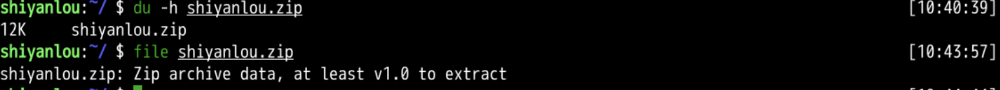

**设置压缩级别**

```sh
cd /home/shiyanlou
# 设置为9级压缩：1-9， 9表示：体积最小，速度最慢
zip -r -9 -q -o shiyanlou2.zip Desktop

# 查看文件的信息
du -h -d 0 *.zip ~ | sort
# -h: --human-readable
# -d: --max-depth 文件折叠的深度

# 注：文件的不是很大，打包后的效果差异不大
```

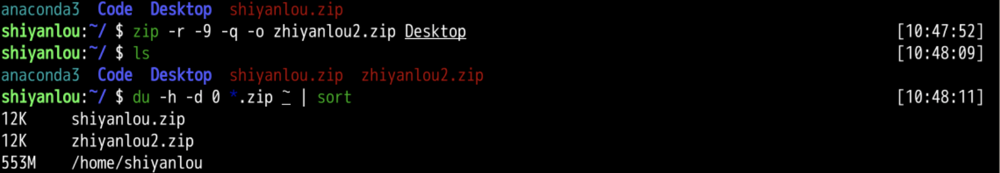

**设置压缩密码**

```sh
# 设置压缩密码
zip -r -e -o shiyanlou_encryption.zip Desktop
# 注：这里没有了 -q 这个参数，也就是说在压缩过程中我们需要打印信息
```

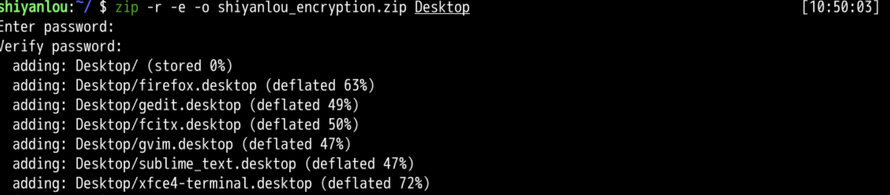

即使加了，也没什么用


- unzip

```sh
# 解压文件
unzip shiyanlou.zip
# 解压shiyanlou.zip,输出到文件夹:ziptest
unzip -q shiyanlou.zip -d ziptest
# 查看压缩包的内容
unzip -l  shiyanlou.zip 
```

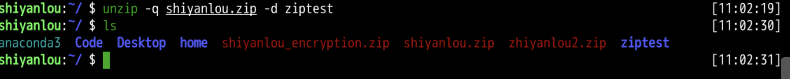

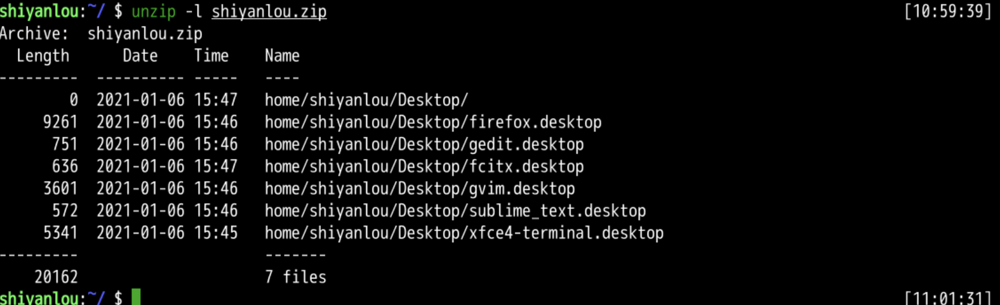

**注意：**

**压缩中文内容的时候，window默认采用GBK编码， 而Linux采用UTF-8编码**， 如果编码不当会产生乱码。因此，可以指定对应编码

```sh
# 大写的O指定编码格式
unzip -O GBK 中文压缩文件.zip
```

- tar

支持7z,  gzip, xz, bzip2文件, 具体参数看文档 man tar

**打包**

```sh
cd /home/shiyanlou 
# 创建一个tar包
tar -P -cf shiyanlou.tar Desktop
# -P 保留绝对路径符
# -c create,创建tar包文件
# -f filename,指定文件名
```

**解包文件**

```sh
# 创建一个文件夹
mkdir tardir
# 解压文件到已经存在的文件夹中
tar -xf shiyanlou.tar -C tardir
# -x extract

```

**支持查看文件内容**

```sh
tar -tf shiyanlou.tar
```

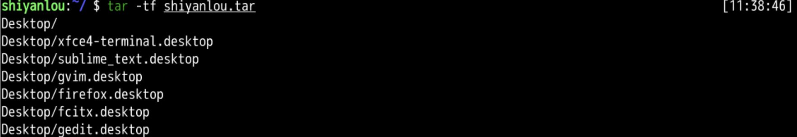

### 文件打包与解压总结

```sh
zip something.zip something (打包目录 -r)
unzip something.zip -d 指定目录

tar
打包: tar -cf something.tar	something
解包: tar -xf something.tar
指定路径： tar -xf something -C midr
```


