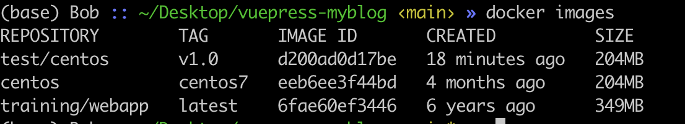
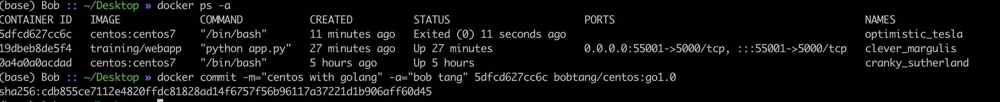
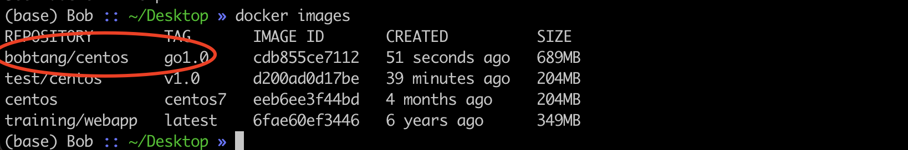
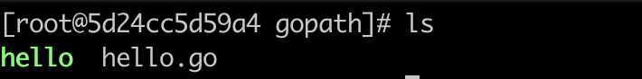
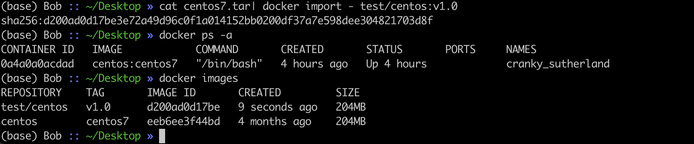
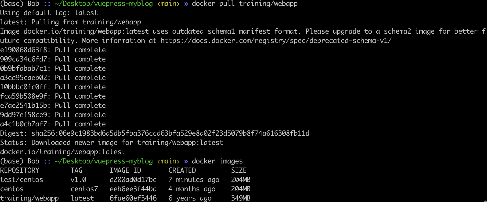
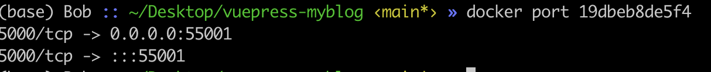
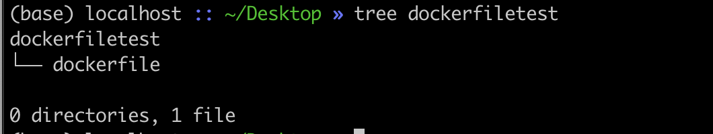

# Docker

**Docker是容器技术的一种优秀实现。**

- 容器技术至隔离应用程序的运行时环境但容器 之间可以共享同一个操作系统。

**运行时环境指运行依赖的各种库以及配置。**


### Docker的基本概念

- docker看成一个编译器

- dockerfile 看成image的源代码

- container 运行起来的程序

- image 理解为可执行程序

  ```sh
  # 查看本地所有的镜像
  docker images
  # 结合git仓库的概念来理解
  # repository 镜像的仓库源， 可认为是程序
  # tag 镜像的标签： 用于区别同仓库的不同版本, 认为程序的不同版本
  # image id 用于标识镜像
  ```

  

**我们编写dockerfile交给docker编译执行生成image, image运行后成为container**


### Docker的工作原理

1. docker build


2. docker run


3. docker pull

docker pull命令从docker hub中下载别人写好的程序， 类似于App Store， Docker Registry是本地的程序。


### Docker中的底层实现原理

- NameSpace

Linux中PID, IPC, 网络等资源是全局的， NameSpace技术可将这些全局资源隔离。

- Control Groups

控制应用对物理机资源的访问

### **Docker Hub的介绍**


- https://hub.docker.com/

Docker hub就像苹果的APP Store， 这里维护者常用的镜像。除了下载常用的镜像，自己也可以发布镜像。

### Docker的基本使用命令

**Docker Hub查看与安装镜像**

```sh
# 在Docker Hub 中查看mysql
docker search mysql
# 安装mysql
docker pull mysql
```

**删除容器与镜像**

>  一般我们用id来标识不同的容器与不同的镜像

```sh
docker rm container_id/container_name
docker rmi image_name/image_id 
```

**查看本地镜像**

```sh
# 查看Dokcer 安装好的images
docker images
```


**进入镜像**

```sh
# 启动images , 此时，iamges ---> container
docker run -it centos:latest /bin/bash
# -i 表示交互式的
# -t 表示开启一个新的终端
# -d 表示后台运行
```

**启动, 停止，重启容器**

```sh
# 连接容器
# 重新进入容器,退出后会让容器暂停运行
docker attach container_name/container_id
# docker exec 退出后不会暂停容器的运行
# docker exec -it container_id /bin/bash
docker exec -it centos:latest /bin/bash

# 停止容器运行
docker stop container_name/container_id
# 重新启动运行
docker restart container_name/container_id
```

**更新镜像**

```sh
# 将镜像跑起来
docker run -it centos:centos7 /bin/bash

# 安装go的环境
cd /user/local
yum install wget # 该工具用于获取golang的安装包
wget https://dl.google.com/go/go1.13.5.linux-amd64.tar.gz # 获取golang的安装包
tar -xzf go1.13.5.linux-amd64.tar.gz -C /usr/local # 解压tar文件到 /user/local

# 为golang添加系统环境变量
vi /etc/profile
# 将以下带export的语句加入到 /ect/profile文件中 (不带 #)
# export GO111MODULE=on
# export GOROOT=/usr/local/go 
# export GOPATH=/home/gopath
# export PATH=$PATH:$GOROOT/bin:$GOPATH/bin

# 执行以下命令,home文件夹下，创建go开发文件夹
cd home
mkdir gopath

# 让 /ect/profile生效
source /etc/profile
# 执行命令, 修改golang代理
go env -w GOPROXY=https://goproxy.cn,direct
# 测试golang 环境
cd /home/gopath
vi hello.go
```

```go
package main
import "fmt"
func main() {
  fmt.Println("hello centos golang!")
}
```

```sh
go run hello.go
```








**容器的导入与导出**

```sh
# 导出容器
# docker export container_id > 文件名.tar
docker export 0a4a0a0acdad > centos.tar
# 导入容器
cat docker/ubantu.tar | docker import -test/ubuntu:v1
```


**查看Docker运行状态**

```sh
docker ps -a
```


**容器转为镜像**

```sh
docker commmit -m "centos with git"
```

**容器打包成镜像文件存在本地&本地加载镜像文件**

```sh
# 打包
# 将容器打包成镜像文件下载到本地
docker save -o docker.tar xiaohu/centos:git
# -o 表示输出，后面紧跟文件名
# 或者使用如下命令 
docker export container_id > 文件名.tar

# 加载
# 加载本地镜像文件到docker
docker load -i docker.tar
# 或者使用命令 docker import
docker import - test/centos:v1.0
# test/centos:v1.0 给docker指定文件路径和tag
```



**查看容器运行的日志**

```sh
docker logs -f image_id
# ctrl + c 终止日志输出
```


**查看容器的运行进程**

```sh
docker top container_id
```


**计算机本地端口的映射**

```sh
docker pull training/webapp
docker run -d -P traning/webapp python app.py

# 显示所有的运行镜像
docker ps -a
# 查看端口配置
docker port container_id
```







### Docker的应用举例

> 开发环境的打包，减少相关人员重复搭建环境，同时提供跨平台的快速部署。

**利用Docker创建一个Flask开发的Python环境**


### Dockerfile

可以将dockerfile看成是docker的批处理命令，类似于Linux的shell文件， 或者windows的bat文件

**以配置一个Nginx为例**

创建文件夹dockderfiletest&文件dockerfile

文件结构目录如下：



`dockerfile`文件内容

```sh
FROM nginx
RUN echo '这是一个本地创建的一个nginx镜像' > /usr/share/nginx/html/index.html
```

shell命令

```sh
docker build -t nginx:v3 .
```


### docker machine

### docker compose

### 参考资料

- 知乎小灰： https://zhuanlan.zhihu.com/p/187505981
- 官方文档:  https://docs.docker.com/
- https://docs.docker.com/engine/reference/builder/
- https://docs.docker.com/develop/develop-images/dockerfile_best-practices/
- https://www.runoob.com/docker/docker-container-usage.html
- Docker绿皮书: http://docs.nigeerhuo.com/docker/#%E6%88%91%E4%B8%BA%E4%BB%80%E4%B9%88%E8%A6%81%E5%86%99%E8%BF%99%E6%9C%AC%E4%B9%A6%EF%BC%9F