# Docker

**Docker是容器技术的一种优秀实现。**

- 容器技术至隔离应用程序的运行时环境但容器 之间可以共享同一个操作系统。

**运行时环境指运行依赖的各种库以及配置。**

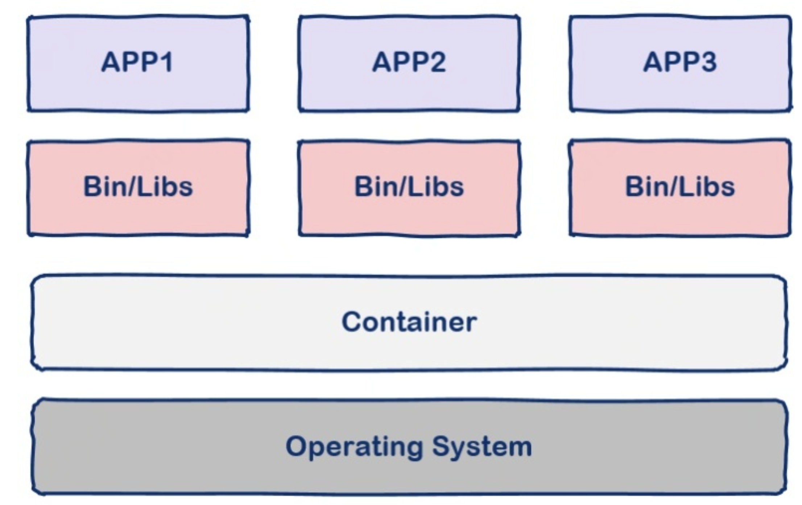


### Docker的基本概念

- docker看成一个编译器

- dockerfile 看成image的源代码
- container 运行起来的程序
- image 理解为可执行程序

**我们编写dockerfile交给docker编译执行生成image, imageu运行后成为container**

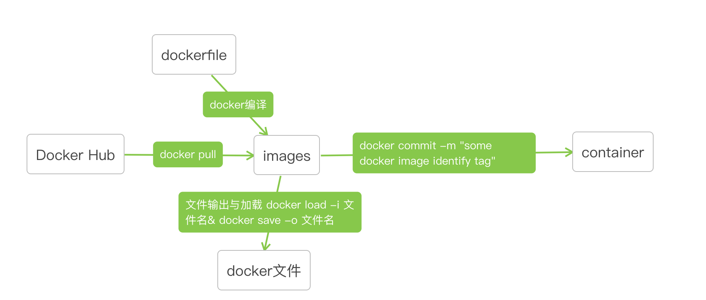

### Docker的工作原理

1. docker build

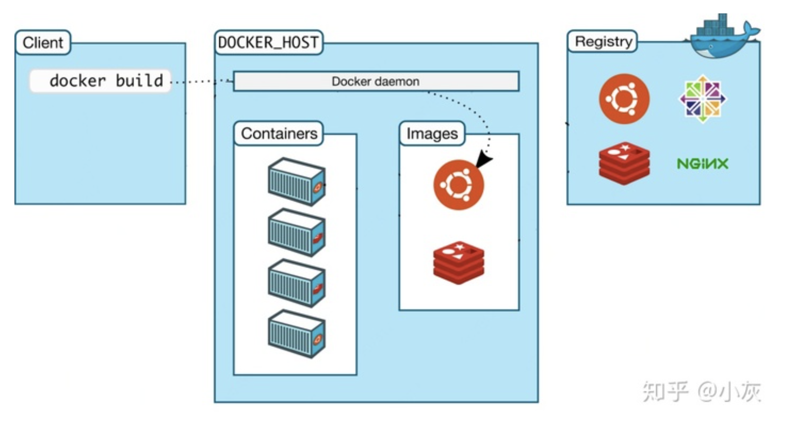

2. docker run

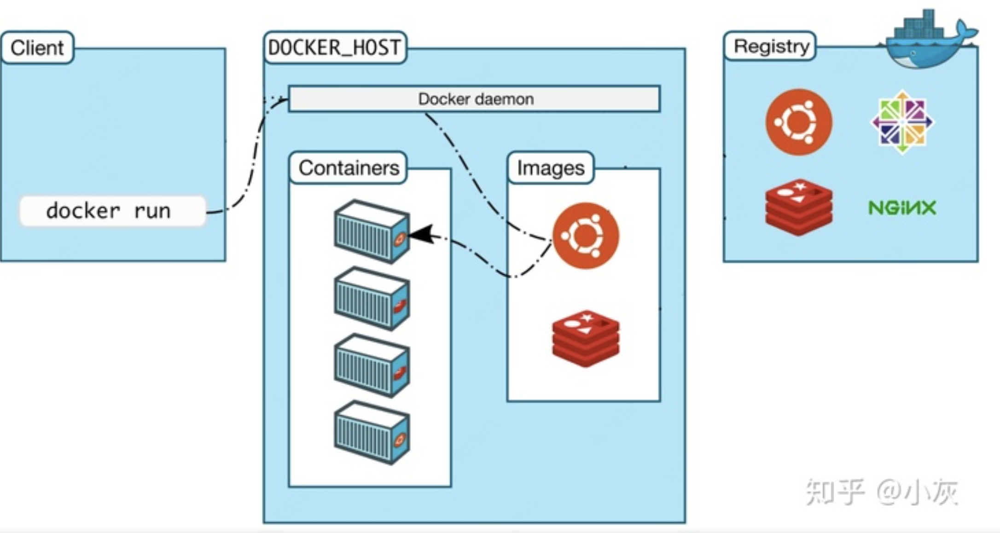

3. docker pull

docker pull命令从docker hub中下载别人写好的程序， 类似于App Store， Docker Registry是本地的程序。

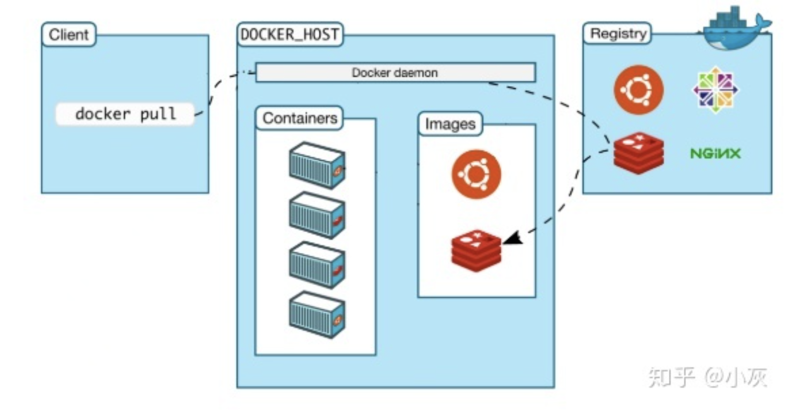

### Docker中的底层实现原理

- NameSpace

Linux中PID, IPC, 网络等资源是全局的， NameSpace技术可将这些全局资源隔离。

- Control Groups

控制应用对物理机资源的访问

### **Docker Hub的介绍**

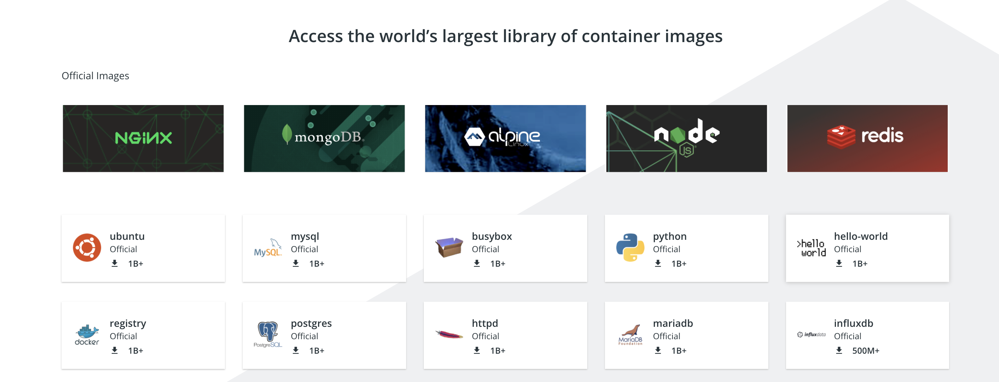

- https://hub.docker.com/

Docker hub就像苹果的APP Store， 这里维护者常用的镜像。除了下载常用的镜像，自己也可以发布镜像。

### Docker的基本使用命令

**Docker Hub查看与安装镜像**

```sh
# 在Docker Hub 中查看mysql
docker search mysql
# 安装mysql
docker pull mysql
```

**删除容器与镜像**

>  一般我们用id来标识不同的容器与不同的镜像

```sh
docker rm container_id/container_name
docker rmi image_name/image_id 
```

**查看本地镜像**

```sh
# 查看Dokcer 安装好的images
docker images
```

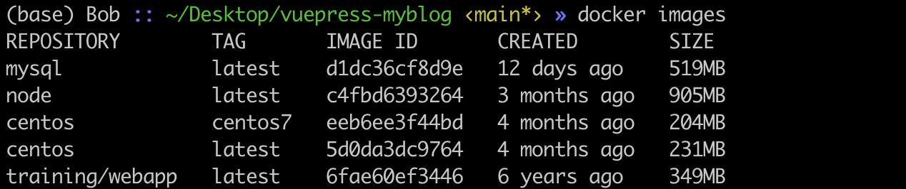

**启动, 停止，重启，重新进入镜像**

```sh
# 第一次启动镜像
docker run -it centos:latest /bin/bash
# -i 表示交互式的
# -t 表示开启一个新的终端
# -d 表示后台运行
# docker exec 退出后不会暂停容器的运行
docker exec -it centos:latest /bin/bash


# # 停止镜像运行
docker stop container_name/container_id
# 镜像重新运行
docker restart container_name/container_id
# 重新进入镜像
docker attach container_name/container_id
```


**查看Docker运行状态**

```sh
docker ps -a
```

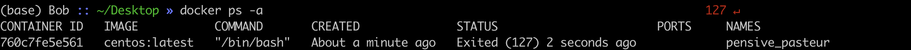

**容器转为镜像**

```sh
docker commmit -m "centos with git"
```

**镜像打包成文件&本地加载镜像文件**

```sh
docker save -o docker.tar xiaohu/centos:git
docker load -i docker.tar
```

**查看镜像运行的日志**

```sh
docker logs -f image_id
# ctrl + c 终止日志输出
```

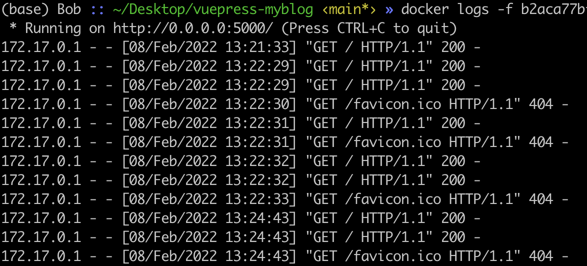

**计算机本地端口的映射**

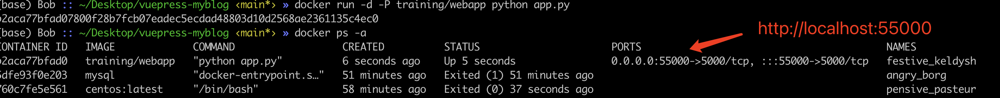

### Docker的应用举例

> 开发环境的打包，减少相关人员重复搭建环境，同时提供跨平台的快速部署。

**利用Docker创建一个Flask开发的Python环境**

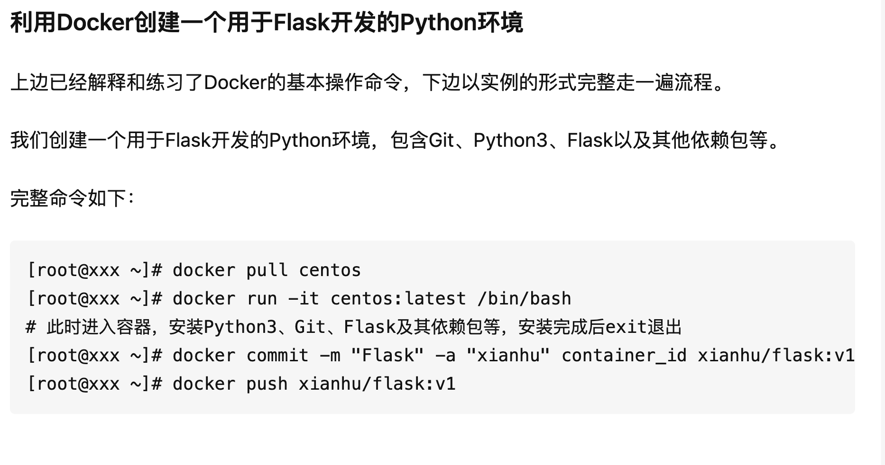

### 参考资料

- 知乎小灰： https://zhuanlan.zhihu.com/p/187505981
- 官方文档:  https://docs.docker.com/
- https://docs.docker.com/engine/reference/builder/
- https://docs.docker.com/develop/develop-images/dockerfile_best-practices/
- https://www.runoob.com/docker/docker-container-usage.html