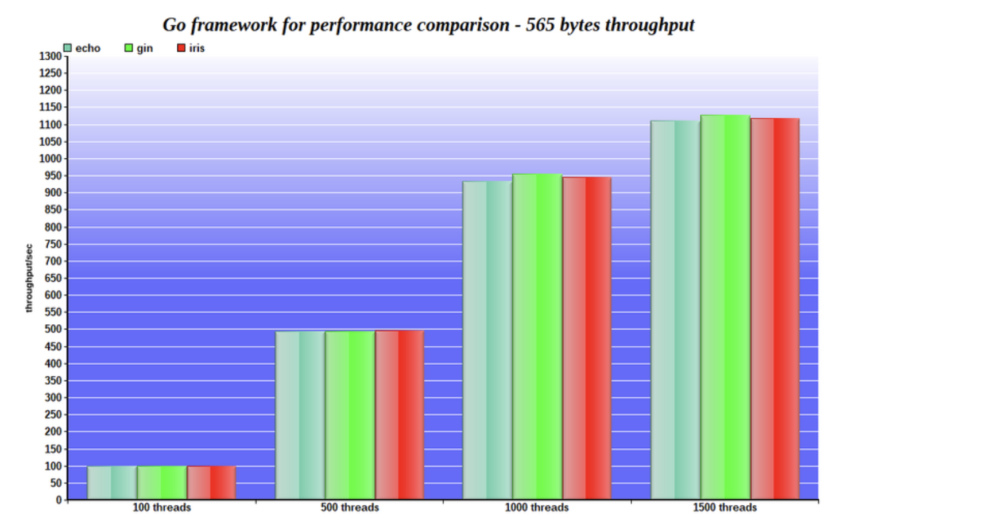
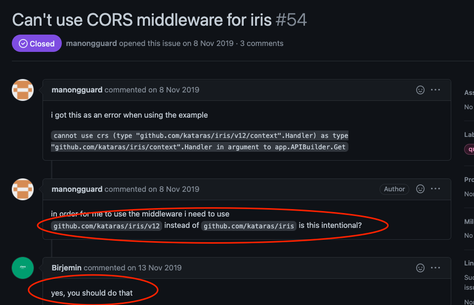

### go语言
- 特点： 兼具Python等动态语言的开发速度和C/C++等编译型语言的性能和安全性。

```sh
# go的安装目录
export GOROOT=$HOME/go
# go可执行文件目录
export GOBIN=$GOROOT/bin
# 将go的可执行文件调价到path
export PATH=$GOBIN:$PATH
# go的工作目录
export GOPATH=$HOME/gopath
```
```sh
# 让上面配置文件生效
source ~/.bashrc
source ~/.zshrc
```

### 验证环境安装 Hello go
main.go文件中输入以下代码
```go
package main
import "fmt"
func main() {
    fmt.Println("Hello go!")
}
```
命令行中执行下面命令
```sh
#  执行main.go文件
go run main.go
# 编译可执行文件
go build main.go
```

### go的依赖管理工具简单使用
- `go mod` 是在开发者们经历混乱的第三方包管理工具割据后推出的, 从 go1.11开始支持
```sh
# 命令行中输入
go mod
# 以下为输出
# Go mod provides access to operations on modules.
# Note that support for modules is built into all the go commands,
# not just 'go mod'. For example, day-to-day adding, removing, upgrading,
# and downgrading of dependencies should be done using 'go get'.
# See 'go help modules' for an overview of module functionality.
# Usage:
# 	go mod <command> [arguments]
# The commands are:
# 	download    download modules to local cache
# 	edit        edit go.mod from tools or scripts
# 	graph       print module requirement graph
# 	init        initialize new module in current directory
# 	tidy        add missing and remove unused modules
# 	vendor      make vendored copy of dependencies
# 	verify      verify dependencies have expected content
# 	why         explain why packages or modules are needed

# Use "go help mod <command>" for more information about a command.
```
- 配置goproxy代理
> 官方的库为google管理，服务器在国外，因此需要代理
```sh
# 新版本的go
go env -w GOPROXY=https://goproxy.cn,direct
# 查看内容
go env

# 老版本的go
export GOPROXY=https://goproxy.cn,direct
```

### 使用`go mod` 初始化新的项目
1. 执行下面命令
```sh
go mod init github.com/mlogclub/GoBBS
```
生成 `go.mod` 文件 ， 类似于 前端npm管理工具生成的 package.json. 

2. 在 `go.md`声明第三方库
```go
module github/mlogclub/GoBBS
go 1.13
require(
    gopkg.in/resty.v1 v1.12.0
)
```
3. 执行 `go mod download` 将依赖下载到本地后,
```sh
# 命令行中执行该命令后，出现go.sum文件
go mod download
```
4. 代码import引入
```go
package main
import(
    "fmt"
    "gopkg.in/resty.v1"
)
func main() {
    resp, err := resty.R().Get("http://www.baidu.com")
    if err == nil {
        fmt.Println(string(resp.Body()))
    }
}
```
### Iris简单使用
- API & MVC开发模式-唯一一个拥有MVC架构模式的Go Web框架,性能成本接近零
- Iris构建微服务很容易
原生的问题： 
当您考虑构建web应用程序和Web API，或者只在Go中构建HTTP服务器时，您是否会考虑使用net/http包？然后您必须处理一些常见情况，如动态路由,安全性，身份验证，实时通信以及net/http无法解决的许多其他问题.



### Iris使用

```sh
go mod init github.com/suckitfa/go-iris-demo
```

安装iris

```sh
go get github.com/kataras/iris@master
```

```go
package main
import(
  "github.com/kataras/iris"
  "github.com/kataras/iris/middleware/logger"
  "github.com/kataras/iris/middleware/recover"
)
func main() {
  app := iris.New()
  app.Logger().setLevel("debug")
  // 中间件的使用
  app.Use(recover.New())
  app.Use(logger.New())
  
  app.Handle("GET", "/html", func (ctx irix.Context) {
    ctx.HTML("<h1>Hello IRIS</h1>")
  })
  app.Get("/text", func(ctx iris.Context) {
    ctx.WriteString("Hello Iris!")
  })
  app.Get("/json", func(ctx iris.Context) {
    ctx.JSON(iris.Map{"message":"Hell Iris!"})
  })
  app.Run(iris.Addr(":8080"), iris.WithoutServerError(iris.ErrServerClosed))
}
```

### Iris控制器的概念

- 能够非常清晰，方便去定义和管理接口。 约定优于配置.

- `controller`的路由规则为：HttpMethod + FuncName（函数名会根据驼峰命名法进行分割），其中`HttpMethod`限定该接口的请求类型，`FuncName`限定接口的路径；
- `controller`中函数名以`Any`开头表示该接口不限定请求类型，任何类型的请求都可以正常访问。
- `controller`中函数名称结尾带`By`关键字的，接受一个输入参数，例如`GetBy`；

```go
package main

import (
	"github.com/kataras/iris/v12"
	"github.com/kataras/iris/v12/middleware/logger"
	"github.com/kataras/iris/v12/middleware/recover"
	"github.com/kataras/iris/v12/mvc"
)
func main() {
  app := iris.New()
  app.Logger().setLevel("debug")
  app.Use(recover.New())
  app.Use(logger.New())
  mvc.Configure(app.Party("/root"), func(mvcApp *mvc.Application) {
    mvcApp.Handle(new(MyController))
  })
  _ = app.Run(iris.Addr(":8080"), iris.WithoutServerError(iris.ErrServerClosed))
}

type MyController struct {
  Ctx iris.Context
}
// GET: http://localhost:8080/root
func (m *MyController) Get() string {
  return "Hey"
}

// GET: http://localhost:8080/root/123
func (m *MyController) GetBy(id int64) interface{} {
  return map[string]interface{}{"id":id}
}

// GET: http://localhost:8080/root/hello/world
func (m * MyController) GetHelloWorld() interface{} {
  return map[string]string{"message":"Hello World!"}
}

func (this *MyController) BeforeActivation(b mvc.BeforeActivation) {
	// 1-> Method
	// 2-> Path
	// 3-> The controller's function name to be parsed as handler
	// 4-> Any handlers that should run before the MyCustomHandler
	b.Handle("GET", "/something/{id:long}", "MyCustomHandler")
}
```

**`BeforeActivation`会在controller适配之前调用，在`BeforeActivation`中你可以自定义路由.**

### Iris中间件的概念

中间件可以将一些通用的操作全部抽象到中间件中去，而不必将这些通用的代码放到每个controller中，以此来减少重复代码和解耦代码。

**web服务端开发中常见的中间件功能**：

- 权限控制
- 接口签名
- 访问统计

```go
package main

import (
    "fmt"
    "strconv"

    "github.com/kataras/iris"
    "github.com/kataras/iris/context"
    "github.com/kataras/iris/mvc"

    "github.com/kataras/iris/middleware/logger"
    "github.com/kataras/iris/middleware/recover"
)

func main() {
    app := iris.New()
    app.Logger().SetLevel("debug")
    app.Use(recover.New())
    app.Use(logger.New())

    count := 0

    mvc.Configure(app.Party("/root"), func(mvcApp *mvc.Application) {
        mvcApp.Router.Use(func(context context.Context) {
            if context.Path() == "/root/test" {
                count++
                fmt.Println("/root/test 请求次数：" + strconv.Itoa(count))
            }
            context.Next() // 加上他让Web进程继续往下执行，否则不会执行controller方法
        })
        mvcApp.Handle(new(MyController))
    })

    _ = app.Run(iris.Addr(":8080"), iris.WithoutServerError(iris.ErrServerClosed))
}

type MyController struct {
    Ctx iris.Context
}

// Any: http://localhost:8080/root/test
func (m *MyController) AnyTest() {
    _, _ = m.Ctx.HTML("<h1>test</h1>")
}
```

### gorm操作数据库

orm框架

- 支持sqlite, mysql, postgreSql, mssql， 连接时制定数据库类型

#### 知识点

- 如何配置数据库链接
- 如何使用 GORM 定义数据模型
- 使用 GORM 完成增删改查

#### 预备知识

- 如何定义结构体
- 结构体字段的 tag 使用

```sh
go get -u github.com/jinzhu/gorm
```

```go
username:password@tcp(数据库地址:端口)/数据库名称
```

### gorm操作数据库基本演示

定义数据模型--go中用结构体表示

```go
type User struct {
  Id int64 `gorm:"PRIMARY_KEY;AUTO_INCREMENT"` // 编号，主键，自增长
  Name string `gorm:"size:32;not null;"`
  Email string `gorm:"size:128;not null;"`// 邮箱 长度128 不可空
}
```

连接数据库

```go
db, err := gorm.Open("mysql","username:password@tcp(localhost:3306)/test_db?charset=utf8mb4&parseTime=True&loc=Local")
if err != nil {
  painc("failed to connect database")
}
defer db.Close()
```

根据结构体创建表

```go
db.AutoMigrate(&User{})
```

查询单条数据

```go
var user User
db.Where("name = ?","小明").First(&user)
fmt.Println("小明： " + user.Email)
```

查询列表数据

```go
var users []User
db.Find(&users)
fmt.Println("总用户数", len(users))
```

删除数据

```go
db.Where("name = ?", "小明").Delete(&User{})
```


### NuxtJS

- nuxt.js的作用

为Vue提供服务端渲染的能力， 增强SEO（将网页在服务端渲染然后返回给浏览器）

- 为啥用nuxt.js， 而不用go的模板引擎

前后端分离是趋势，便于项目的解耦，关注点分离。go专注提供数据接口，nuxt.js专注于渲染页面，项目结构清晰明了； 数据接口服务和页面渲染服务可以单独部署方便维护。

- 如何穿件nuxt.js项目

```sh
npx create-nuxt-app <项目名>
```

- nuxt.js的项目结构

```sh
└── site
    ├── README.md
    ├── assets
    │   └── README.md
    ├── components
    │   ├── Logo.vue
    │   └── README.md
    ├── jsconfig.json
    ├── layouts
    │   ├── README.md
    │   └── default.vue
    ├── middleware
    │   └── README.md
    ├── nuxt.config.js
    ├── package-lock.json
    ├── package.json
    ├── pages
    │   ├── README.md
    │   ├── index.vue
    │   └── test.vue
    ├── plugins
    │   └── README.md
    ├── static
    │   ├── README.md
    │   └── favicon.ico
    └── store
        └── README.md
```

- nuxt基础路由

nuxt自动根据`page目录`下的组件生成路由

```sh
假设pages目录结构为
-pages
	--user
	---info
	
=>生成路由的路径为： /user/info
```

### nuxt.js中引入CSS框架`bulma `

- 先安装 @nuxtjs/bulma

- https://www.npmjs.com/package/@nuxtjs/bulma

```sh
npm i @nuxtjs/bulma
```

- `nuxt.config.js` 文件中引入

```js
modules: [
    '@nuxtjs/bulma',
  ],
```


#### Nuxt.js提供的能力

- 自定义组件
- 数据请求
- 动态路由
- 页面布局

### Go Iris Web FrameWork 

提供跨域的能力

**遇到的问题**



### Nuxt.js获取数据

- asyncData 在设置组件数据之前异步的获取数据，在页面每次加载之前调用， 会将组件的data融合一起返回。

```js
// 这里是nuxtjs提供的获取数据的能力
  // 自动与data混合, 因此可以直接在模板中使用
  async asyncData({$axios}) {
    const resp = await $axios.get('/api/json')
    return {
      curTime:resp.data.curTime
    }
  }
```

### Nuxt.js的路由

restful风格的路由，是基于文件系统来自动生成的.

`Nuxt.js`路径结构是 restful 风格的，我们可以根据页面文件路径来定义带参数的路由。路由参数需要将`文件夹`或`文件`名称以下划线开头，即表示为动态参数。例如：

| 路由           | 目录结构                 |
| -------------- | ------------------------ |
| /user/123      | /pages/user/_id.vue      |
| /user/123/info | /pages/user/_id/info.vue |

在页面中我们可以通过`Nuxt.js context`中的`params`对象来获取路由参数。下面我们通过一个实例来学习和验证效果：

新增`/pages/user/_id.vue`文件，文件内容如下：

```vue
<template>
  <section>
    <my-nav />
    <div class="container">
      <div class="notification">当前数据编号：{{ curId }}</div>
    </div>
    <my-footer />
  </section>
</template>

<script>
import MyNav from '~/components/MyNav';
import MyFooter from '~/components/MyFooter';

export default {
  components: {
    MyNav,
    MyFooter,
  },
  async asyncData({ params }) {
    return {
      curId: params.id,
    };
  },
};
</script>

<style>
.container {
  min-height: 300px;
}
</style>
```

#### Nuxtjs的自定义布局

同一个网站，一般情况下顶部导航和底部等在所有页面中都是一样的，为避免重复代码, Nuxt.js 提供了布局功能，默认布局为`default`，我们也可以自定义布局文件，下面我们打开项目的`layouts`，去新建一个自定义布局：`bbs`。在`layouts`文件夹下新建文件`bbs.vue`，内容如下：

```html
<template>
  <div>
    <div class="header">
      我是顶部
    </div>

    <nuxt />

    <div class="footer">
      我是底部
    </div>
  </div>
</template>

<script>
  export default {};
</script>

<style scoped>
  .header,
  .footer {
    font-size: 24px;
    color: red;
  }
</style>
```

上面我们定义了一个名为`bbs`的布局，下面我们将首页修改为该布局，编辑页面文件`pages/index.vue`，在代码中加上一行：`layout: 'bbs'`，代码如下：

```js
export default {
  layout: 'bbs',
  components: {
    Logo,
  },
};
```

接下来我们刷新下页面，就能看到效果了。


### Go Iris的MVC模式开发--用户模块

- model 定义结构体，与数据库中的表结构一一对应
- service 编写业务逻辑，读写数据库
- controller对外提供接口

```go
```

